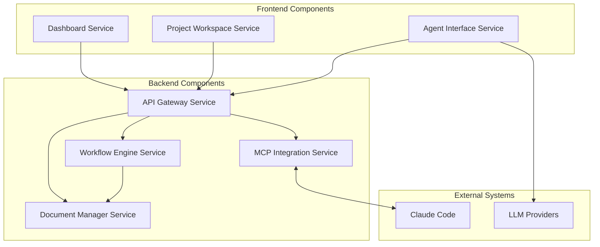

# Components

## Frontend Components

### Dashboard Service
**Purpose:** Manages portfolio overview and project navigation interface
**Key Features:**
- Multi-client project overview with status indicators
- Real-time activity feed showing recent project changes
- Quick action buttons for project creation and management
- Search and filtering capabilities across all projects
- Client/service hierarchy navigation

### Project Workspace Service
**Purpose:** Provides comprehensive project management and workflow interface
**Key Features:**
- Project detail views with BMAD workflow status
- Document viewer with GitHub-style change tracking
- Gate review interface for workflow approvals
- File synchronization status and controls
- Project settings and configuration management

### Agent Interface Service
**Purpose:** Conversational AI interface for project qualification assistance
**Key Features:**
- Project-specific conversation context
- BMAD workflow guidance and recommendations
- Document analysis and feedback generation
- Integration with multiple LLM providers
- Conversation history and context persistence

## Backend Components

### API Gateway Service
**Purpose:** Central entry point for all API requests with cross-cutting concerns
**Key Features:**
- Request routing and load balancing
- Authentication and authorization middleware
- Rate limiting and request throttling
- API documentation generation
- Error handling and response formatting

### Workflow Engine Service
**Purpose:** Manages BMAD Method workflow automation and state transitions
**Key Features:**
- Workflow template import from Claude Code configurations
- State machine implementation for workflow progression
- Gate validation and approval processing
- Event-driven workflow transitions
- Audit trail generation for all workflow events

### Document Manager Service
**Purpose:** Handles document storage, versioning, and change tracking
**Key Features:**
- Markdown document processing and rendering
- Version control with change detection
- Mermaid diagram rendering support
- Bilingual content management (French/English)
- Content synchronization with Claude Code projects

### MCP Integration Service
**Purpose:** Bidirectional integration with Claude Code via MCP protocol
**Key Features:**
- Real-time file synchronization
- Connection management with retry logic
- Conflict resolution for concurrent modifications
- Context sharing between AgentLab and Claude Code
- Feedback writing to development environment

## Component Diagrams

---
[← Back to API Specification](api-specification.md) | [Architecture Index](index.md) | [Next: External APIs →](external-apis.md)