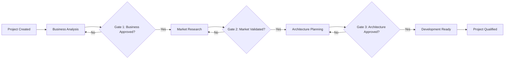

# Core Workflows

## BMAD Method Workflow Implementation

AgentLab implements the BMAD (Business, Market, Architecture, Development) Method workflow automation to streamline project qualification from concept to development-ready state.

### Workflow Stages

1. **Business Analysis Stage**
   - Requirements gathering and validation
   - Stakeholder identification and engagement
   - Business case development
   - Success criteria definition

2. **Market Research Stage**
   - Competitive analysis
   - User research and persona development
   - Market sizing and opportunity assessment
   - Go-to-market strategy outline

3. **Architecture Planning Stage**
   - Technical architecture design
   - Technology stack selection
   - System integration planning
   - Infrastructure requirements

4. **Development Preparation Stage**
   - Development roadmap creation
   - Resource allocation planning
   - Risk assessment and mitigation
   - Development environment setup

### Gate Management Process

Each workflow stage includes gates that require human approval before progression:

### Workflow State Management

The system maintains comprehensive workflow state including:
- Current stage and substage tracking
- Completed deliverables and artifacts
- Gate approval status and comments
- Time spent in each stage
- Blocker identification and resolution

### Project Lifecycle Integration

Projects flow through the complete lifecycle from initial concept through development handoff:

1. **Project Creation:** Initialize with client/service association
2. **Qualification:** BMAD workflow execution with gate validations
3. **Development Handoff:** Claude Code integration and context transfer
4. **Active Development:** Ongoing synchronization and feedback
5. **Completion:** Final deliverable validation and project closure

---
[← Back to External APIs](external-apis.md) | [Architecture Index](index.md) | [Next: Database Schema →](database-schema.md)