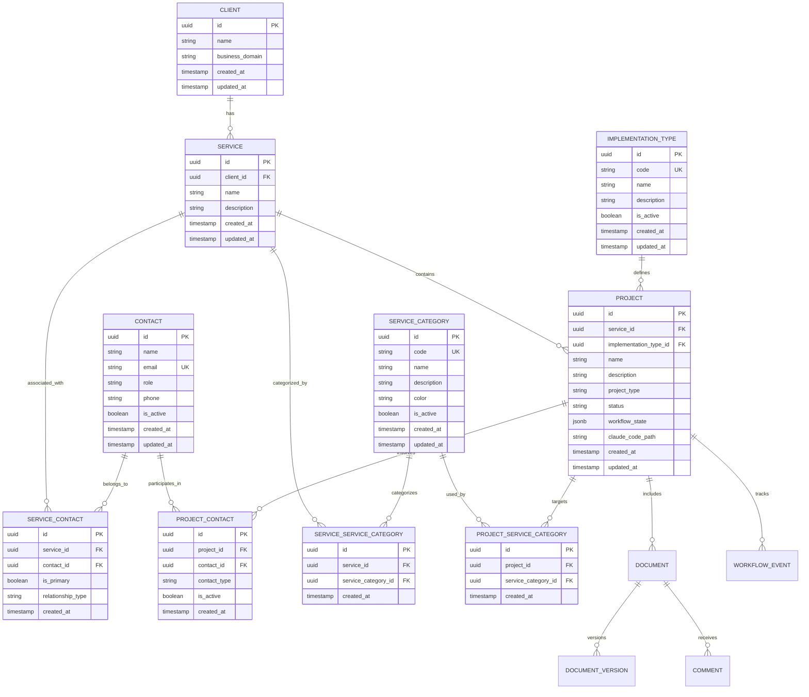

# Database Schema

## PostgreSQL + pgvector Schema Design

The database schema supports the hierarchical client-service-project structure with comprehensive workflow tracking and document management capabilities.

### Reference Tables

#### implementation_type
```sql
CREATE TABLE implementation_type (
    id UUID PRIMARY KEY DEFAULT gen_random_uuid(),
    code VARCHAR(50) NOT NULL UNIQUE,
    name VARCHAR(100) NOT NULL,
    description TEXT,
    is_active BOOLEAN DEFAULT TRUE,
    created_at TIMESTAMP WITH TIME ZONE DEFAULT NOW(),
    updated_at TIMESTAMP WITH TIME ZONE DEFAULT NOW()
);

-- Seed data
INSERT INTO implementation_type (code, name, description) VALUES
('RAG', 'Retrieval-Augmented Generation', 'Systems that combine retrieval and generation for enhanced AI responses'),
('AGENTIC', 'Agentic AI', 'Autonomous AI agents capable of independent decision-making and task execution'),
('AUTOMATON', 'Process Automation', 'Rule-based automation systems for workflow and business process automation'),
('CHATBOT', 'Conversational AI', 'Interactive chat-based AI systems for customer service and support'),
('ANALYTICS', 'AI Analytics', 'Data analysis and insights generation using AI/ML techniques'),
('RECOMMENDATION', 'Recommendation Engine', 'Personalized recommendation systems for content or product suggestions');
```

#### service_category
```sql
CREATE TABLE service_category (
    id UUID PRIMARY KEY DEFAULT gen_random_uuid(),
    code VARCHAR(50) NOT NULL UNIQUE,
    name VARCHAR(100) NOT NULL,
    description TEXT,
    color VARCHAR(7), -- Hex color for UI display
    is_active BOOLEAN DEFAULT TRUE,
    created_at TIMESTAMP WITH TIME ZONE DEFAULT NOW(),
    updated_at TIMESTAMP WITH TIME ZONE DEFAULT NOW()
);

-- Seed data
INSERT INTO service_category (code, name, description, color) VALUES
('SALES', 'Sales & Marketing', 'Sales operations, lead generation, and marketing automation', '#2563eb'),
('HR', 'Human Resources', 'HR processes, recruitment, employee management', '#dc2626'),
('FINANCE', 'Finance & Accounting', 'Financial operations, accounting, and reporting', '#059669'),
('OPERATIONS', 'Operations', 'Business operations and process management', '#7c3aed'),
('CUSTOMER_SERVICE', 'Customer Service', 'Customer support and service operations', '#ea580c'),
('IT', 'Information Technology', 'IT infrastructure and technical services', '#0891b2'),
('LEGAL', 'Legal & Compliance', 'Legal services and regulatory compliance', '#4338ca'),
('PRODUCT', 'Product Management', 'Product development and management', '#be185d'),
('EXECUTIVE', 'Executive & Strategy', 'C-level and strategic decision support', '#059669');
```

#### contact
```sql
CREATE TABLE contact (
    id UUID PRIMARY KEY DEFAULT gen_random_uuid(),
    name VARCHAR(255) NOT NULL,
    email VARCHAR(255) NOT NULL,
    role VARCHAR(100),
    phone VARCHAR(50),
    is_active BOOLEAN DEFAULT TRUE,
    created_at TIMESTAMP WITH TIME ZONE DEFAULT NOW(),
    updated_at TIMESTAMP WITH TIME ZONE DEFAULT NOW(),
    UNIQUE(email)
);
```

### Core Tables

#### client
```sql
CREATE TABLE client (
    id UUID PRIMARY KEY DEFAULT gen_random_uuid(),
    name VARCHAR(255) NOT NULL,
    business_domain VARCHAR(50) NOT NULL,
    created_at TIMESTAMP WITH TIME ZONE DEFAULT NOW(),
    updated_at TIMESTAMP WITH TIME ZONE DEFAULT NOW()
);
```

#### service
```sql
CREATE TABLE service (
    id UUID PRIMARY KEY DEFAULT gen_random_uuid(),
    name VARCHAR(255) NOT NULL,
    description TEXT,
    client_id UUID NOT NULL REFERENCES client(id) ON DELETE CASCADE,
    created_at TIMESTAMP WITH TIME ZONE DEFAULT NOW(),
    updated_at TIMESTAMP WITH TIME ZONE DEFAULT NOW()
);
```

#### project
```sql
CREATE TABLE project (
    id UUID PRIMARY KEY DEFAULT gen_random_uuid(),
    name VARCHAR(255) NOT NULL,
    description TEXT NOT NULL,
    service_id UUID NOT NULL REFERENCES service(id) ON DELETE CASCADE,
    project_type VARCHAR(20) NOT NULL CHECK (project_type IN ('new', 'existing')),
    implementation_type_id UUID REFERENCES implementation_type(id),
    status VARCHAR(20) NOT NULL DEFAULT 'draft',
    workflow_state JSONB NOT NULL DEFAULT '{}',
    claude_code_path VARCHAR(500),
    created_at TIMESTAMP WITH TIME ZONE DEFAULT NOW(),
    updated_at TIMESTAMP WITH TIME ZONE DEFAULT NOW()
);
```

#### document
```sql
CREATE TABLE document (
    id UUID PRIMARY KEY DEFAULT gen_random_uuid(),
    project_id UUID NOT NULL REFERENCES project(id) ON DELETE CASCADE,
    name VARCHAR(255) NOT NULL,
    content TEXT NOT NULL,
    content_hash VARCHAR(64) NOT NULL,
    version INTEGER NOT NULL DEFAULT 1,
    language VARCHAR(2) NOT NULL DEFAULT 'en',
    document_type VARCHAR(20) NOT NULL,
    content_vector vector(1536), -- pgvector for semantic search
    created_at TIMESTAMP WITH TIME ZONE DEFAULT NOW(),
    updated_at TIMESTAMP WITH TIME ZONE DEFAULT NOW()
);
```

#### workflow_event
```sql
CREATE TABLE workflow_event (
    id UUID PRIMARY KEY DEFAULT gen_random_uuid(),
    project_id UUID NOT NULL REFERENCES project(id) ON DELETE CASCADE,
    event_type VARCHAR(20) NOT NULL,
    from_stage VARCHAR(100),
    to_stage VARCHAR(100) NOT NULL,
    user_id UUID NOT NULL,
    metadata JSONB NOT NULL DEFAULT '{}',
    timestamp TIMESTAMP WITH TIME ZONE DEFAULT NOW()
);
```

### Many-to-Many Relationship Tables

#### service_service_category
```sql
CREATE TABLE service_service_category (
    id UUID PRIMARY KEY DEFAULT gen_random_uuid(),
    service_id UUID NOT NULL REFERENCES service(id) ON DELETE CASCADE,
    service_category_id UUID NOT NULL REFERENCES service_category(id) ON DELETE CASCADE,
    created_at TIMESTAMP WITH TIME ZONE DEFAULT NOW(),
    UNIQUE(service_id, service_category_id)
);
```

#### project_service_category
```sql
CREATE TABLE project_service_category (
    id UUID PRIMARY KEY DEFAULT gen_random_uuid(),
    project_id UUID NOT NULL REFERENCES project(id) ON DELETE CASCADE,
    service_category_id UUID NOT NULL REFERENCES service_category(id) ON DELETE CASCADE,
    created_at TIMESTAMP WITH TIME ZONE DEFAULT NOW(),
    UNIQUE(project_id, service_category_id)
);
```

#### service_contact
```sql
CREATE TABLE service_contact (
    id UUID PRIMARY KEY DEFAULT gen_random_uuid(),
    service_id UUID NOT NULL REFERENCES service(id) ON DELETE CASCADE,
    contact_id UUID NOT NULL REFERENCES contact(id) ON DELETE CASCADE,
    is_primary BOOLEAN DEFAULT FALSE,
    relationship_type VARCHAR(50) DEFAULT 'main', -- main, billing, technical, etc.
    created_at TIMESTAMP WITH TIME ZONE DEFAULT NOW(),
    UNIQUE(service_id, contact_id)
);
```

#### project_contact
```sql
CREATE TABLE project_contact (
    id UUID PRIMARY KEY DEFAULT gen_random_uuid(),
    project_id UUID NOT NULL REFERENCES project(id) ON DELETE CASCADE,
    contact_id UUID NOT NULL REFERENCES contact(id) ON DELETE CASCADE,
    contact_type VARCHAR(50) DEFAULT 'stakeholder', -- stakeholder, reviewer, approver, etc.
    is_active BOOLEAN DEFAULT TRUE,
    created_at TIMESTAMP WITH TIME ZONE DEFAULT NOW(),
    UNIQUE(project_id, contact_id, contact_type)
);
```

### Supporting Tables

#### document_version
```sql
CREATE TABLE document_version (
    id UUID PRIMARY KEY DEFAULT gen_random_uuid(),
    document_id UUID NOT NULL REFERENCES document(id) ON DELETE CASCADE,
    version INTEGER NOT NULL,
    content TEXT NOT NULL,
    content_hash VARCHAR(64) NOT NULL,
    change_summary TEXT,
    created_by UUID NOT NULL,
    created_at TIMESTAMP WITH TIME ZONE DEFAULT NOW()
);
```

#### comment
```sql
CREATE TABLE comment (
    id UUID PRIMARY KEY DEFAULT gen_random_uuid(),
    document_id UUID NOT NULL REFERENCES document(id) ON DELETE CASCADE,
    user_id UUID NOT NULL,
    content TEXT NOT NULL,
    line_number INTEGER,
    resolved BOOLEAN DEFAULT FALSE,
    created_at TIMESTAMP WITH TIME ZONE DEFAULT NOW(),
    updated_at TIMESTAMP WITH TIME ZONE DEFAULT NOW()
);
```

### Indexes and Performance Optimization

```sql
-- Primary lookup indexes
CREATE INDEX idx_service_client_id ON service(client_id);
CREATE INDEX idx_project_service_id ON project(service_id);
CREATE INDEX idx_project_implementation_type ON project(implementation_type_id);
CREATE INDEX idx_document_project_id ON document(project_id);
CREATE INDEX idx_workflow_event_project_id ON workflow_event(project_id);

-- Many-to-many relationship indexes
CREATE INDEX idx_service_service_category_service_id ON service_service_category(service_id);
CREATE INDEX idx_service_service_category_category_id ON service_service_category(service_category_id);
CREATE INDEX idx_project_service_category_project_id ON project_service_category(project_id);
CREATE INDEX idx_project_service_category_category_id ON project_service_category(service_category_id);
CREATE INDEX idx_service_contact_service_id ON service_contact(service_id);
CREATE INDEX idx_service_contact_contact_id ON service_contact(contact_id);
CREATE INDEX idx_project_contact_project_id ON project_contact(project_id);
CREATE INDEX idx_project_contact_contact_id ON project_contact(contact_id);

-- Reference table indexes
CREATE INDEX idx_implementation_type_code ON implementation_type(code);
CREATE INDEX idx_implementation_type_active ON implementation_type(is_active);
CREATE INDEX idx_service_category_code ON service_category(code);
CREATE INDEX idx_service_category_active ON service_category(is_active);
CREATE INDEX idx_contact_email ON contact(email);
CREATE INDEX idx_contact_active ON contact(is_active);
CREATE INDEX idx_contact_name ON contact(name);

-- Search and filtering indexes
CREATE INDEX idx_project_status ON project(status);
CREATE INDEX idx_project_type ON project(project_type);
CREATE INDEX idx_document_type ON document(document_type);
CREATE INDEX idx_document_language ON document(language);

-- Vector similarity search index
CREATE INDEX idx_document_vector ON document USING ivfflat (content_vector vector_cosine_ops);

-- Composite indexes for common queries
CREATE INDEX idx_project_service_status ON project(service_id, status);
CREATE INDEX idx_project_service_impl_type ON project(service_id, implementation_type_id);
CREATE INDEX idx_workflow_event_project_timestamp ON workflow_event(project_id, timestamp);
CREATE INDEX idx_service_contact_primary ON service_contact(service_id, is_primary);
CREATE INDEX idx_project_contact_active ON project_contact(project_id, is_active);
```

### Data Relationships



### Data Model Improvements

#### Key Enhancements Made:

1. **Reference Tables**: Created `implementation_types` and `service_categories` tables for normalized data management
2. **Many-to-Many Relationships**: Services can have multiple categories, projects can target multiple user categories
3. **Data Consistency**: Foreign key constraints ensure referential integrity
4. **Extensibility**: Easy to add new implementation types and service categories without schema changes
5. **UI Support**: Added color codes for category visualization

#### Common Queries

```sql
-- Get all services with their categories
SELECT s.name, s.description,
       ARRAY_AGG(sc.name) as categories
FROM service s
LEFT JOIN service_service_category ssc ON s.id = ssc.service_id
LEFT JOIN service_category sc ON ssc.service_category_id = sc.id
WHERE sc.is_active = true
GROUP BY s.id, s.name, s.description;

-- Get projects by implementation type
SELECT p.name, it.name as implementation_type, it.description
FROM project p
JOIN implementation_type it ON p.implementation_type_id = it.id
WHERE it.code = 'RAG';

-- Get projects targeting specific user categories
SELECT p.name, p.description,
       ARRAY_AGG(sc.name) as target_user_categories
FROM project p
LEFT JOIN project_service_category psc ON p.id = psc.project_id
LEFT JOIN service_category sc ON psc.service_category_id = sc.id
WHERE sc.code IN ('SALES', 'MARKETING')
GROUP BY p.id, p.name, p.description;

-- Analytics: Services by category distribution
SELECT sc.name, COUNT(DISTINCT s.id) as service_count
FROM service_category sc
LEFT JOIN service_service_category ssc ON sc.id = ssc.service_category_id
LEFT JOIN service s ON ssc.service_id = s.id
WHERE sc.is_active = true
GROUP BY sc.id, sc.name
ORDER BY service_count DESC;

-- Get all contacts for a client (through services)
SELECT DISTINCT c.name, c.email, c.role, sc.relationship_type, s.name as service_name
FROM client cl
JOIN service s ON cl.id = s.client_id
JOIN service_contact sc ON s.id = sc.service_id
JOIN contact c ON sc.contact_id = c.id
WHERE cl.id = 'client-uuid' AND c.is_active = true
ORDER BY sc.is_primary DESC, c.name;

-- Get primary contact for each service
SELECT s.name as service_name, c.name as primary_contact, c.email, c.role
FROM service s
JOIN service_contact sc ON s.id = sc.service_id AND sc.is_primary = true
JOIN contact c ON sc.contact_id = c.id
WHERE c.is_active = true;

-- Get all project stakeholders with their roles
SELECT p.name as project_name, c.name as contact_name, c.email,
       pc.contact_type, c.role as business_role
FROM project p
JOIN project_contact pc ON p.id = pc.project_id AND pc.is_active = true
JOIN contact c ON pc.contact_id = c.id
WHERE p.id = 'project-uuid' AND c.is_active = true
ORDER BY pc.contact_type, c.name;

-- Contact workload: How many active projects each contact is involved in
SELECT c.name, c.email, c.role,
       COUNT(DISTINCT pc.project_id) as active_projects,
       ARRAY_AGG(DISTINCT pc.contact_type) as project_roles
FROM contact c
JOIN project_contact pc ON c.id = pc.contact_id AND pc.is_active = true
JOIN project p ON pc.project_id = p.id
WHERE c.is_active = true AND p.status IN ('active', 'in_progress')
GROUP BY c.id, c.name, c.email, c.role
ORDER BY active_projects DESC;
```

---
[← Back to Core Workflows](core-workflows.md) | [Architecture Index](index.md) | [Next: Frontend Architecture →](frontend-architecture.md)