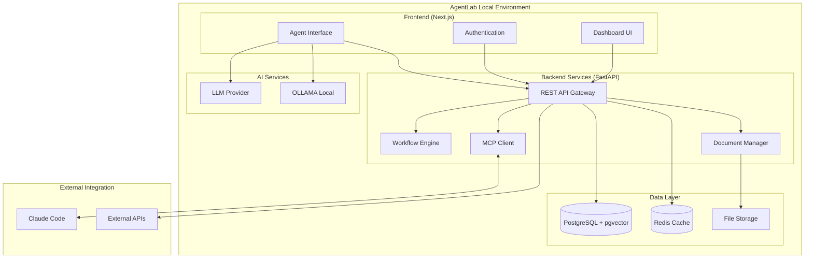

# High Level Architecture

## Starter Template or Existing Project

Based on analysis of the PRD and specifications, AgentLab is a **greenfield project** with specific technical preferences already defined:

- **Backend:** Python FastAPI + PostgreSQL + pgvector
- **Frontend:** Next.js + TypeScript + shadcn/ui + Tailwind CSS
- **Infrastructure:** Docker-compose + Local-first deployment
- **Integration:** MCP protocol for Claude Code connectivity

**Decision:** Since the technical stack is well-defined in the PRD, we proceed with a custom architecture rather than using a generic starter template. This allows optimization specifically for BMAD Method automation and Claude Code integration.

## Technical Summary

AgentLab employs a **containerized modular monolith architecture** with Docker-compose orchestration, enabling local-first deployment while maintaining enterprise-grade capabilities. The system combines Python FastAPI backend services with Next.js App Router frontend, connected through RESTful APIs and real-time MCP protocol integration for Claude Code synchronization. The architecture leverages PostgreSQL with pgvector extension for both relational data management and semantic search capabilities, while supporting multiple LLM providers (OpenAI, Anthropic, OLLAMA) through a unified abstraction layer. This design achieves the PRD's productivity goals through specialized BMAD Method workflow automation, bilingual document management, and seamless AI development tool integration.

## Platform and Infrastructure Choice

**Platform:** Local-First Docker Containerization + Optional Cloud Deployment
**Key Services:** Docker-compose orchestration, PostgreSQL+pgvector, Redis caching, nginx reverse proxy, Optional OLLAMA for local LLM
**Deployment Host and Regions:** Primary: Developer desktop via docker-compose, Secondary: Any Docker-compatible host (AWS EC2, Digital Ocean, self-hosted)

## Repository Structure

**Structure:** Monorepo with clear frontend/backend separation
**Monorepo Tool:** npm workspaces (lightweight, built-in to Node.js ecosystem)
**Package Organization:** Apps (web frontend, api backend) + Shared packages (types, utilities, UI components)

## High Level Architecture Diagram

## Architectural Patterns

- **Modular Monolith:** Single deployable application with clear service boundaries - _Rationale:_ Simplifies development and deployment while maintaining modularity for future microservice extraction
- **Repository Pattern:** Abstract data access logic behind interfaces - _Rationale:_ Enables testing, maintainability, and potential database migration flexibility
- **Service Layer Pattern:** Business logic separated from API controllers - _Rationale:_ Promotes reusability and testability of core business operations
- **Command Query Responsibility Segregation (Light CQRS):** Separate read/write operations for complex workflows - _Rationale:_ Optimizes BMAD workflow state management and audit trails
- **Event-Driven Architecture:** Async processing for file sync and workflow transitions - _Rationale:_ Improves responsiveness and enables reliable MCP integration
- **Component-Based UI:** Modular React components with TypeScript - _Rationale:_ Maintainability and consistency across complex project management interfaces
- **API Gateway Pattern:** Single entry point with middleware for auth, rate limiting - _Rationale:_ Centralized cross-cutting concerns and simplified client integration

---
[← Back to Architecture Index](index.md) | [Next: Tech Stack →](tech-stack.md)