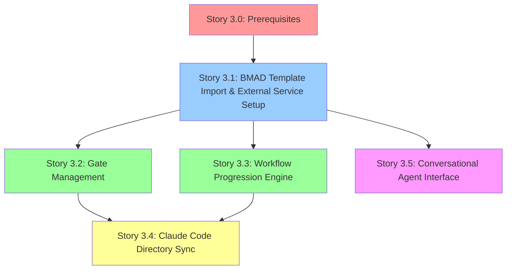

# Epic 3: BMAD Method Workflow Integration

**Epic Status:** 🟡 Ready to Start (Pending Story 3.0 Completion)
**Epic Duration:** 2-3 weeks (after Prerequisites Phase)
**Total Effort:** 54-74 hours (44-60 hours with parallelization)
**Stories:** 6 stories (3.0 Prerequisites + 3.1-3.5 Implementation)
**Start Date:** TBD (after Story 3.0 complete)
**Team:** Dev Lead, Developer 2 (if available), QA Engineer (Quinn), Architect (Winston), Product Owner (Sarah)

---

## Epic Goal

Integrate BMAD Method workflow automation with Claude Code configuration files, implementing gate management, workflow progression tracking, and conversational agent interfaces for qualification assistance.

---

## Epic Description

**Project Context:**
The core value proposition of AgentLab is automating BMAD Method qualification workflows. This epic implements the specialized workflow engine that imports templates from Claude Code, tracks progression, and provides human gate validation with AI assistance.

**Epic Scope:**
This epic implements:

- BMAD workflow template import from Claude Code configuration
- Gate management interface for human reviewers
- Workflow progression and state management
- Conversational agent interface for qualification assistance
- Integration with Claude Code project directories
- Feedback and validation result writing to markdown folders

---

## Epic 3 Prerequisites (Story 3.0)

**⚠️ CRITICAL:** Story 3.0 must complete before Stories 3.1-3.5 can start.

### Story 3.0: Epic 3 Prerequisites & Blockers Resolution

**Status:** ✅ Approved for Development (100/100 quality score)
**Effort:** 28-38 hours (1 week, 5 business days)
**Priority:** P0-Blocker
**Owner:** Dev Lead + QA Engineer (Quinn)
**Document:** [docs/stories/story-3.0-epic-3-prerequisites-and-blockers.md](../stories/story-3.0-epic-3-prerequisites-and-blockers.md)

**Deliverables:**

- Epic 2 quality gaps fixed (Stories 2.3, 2.4 → 100/100)
- Async driver configuration fixed (integration tests executable)
- Epic 3 external dependencies documented (MCP, OpenAI, Anthropic, OLLAMA)
- 5 developer handoff documents created (Stories 3.1-3.5, Story 2.1 format)
- Migration validation automated in CI/CD
- Prerequisites validation report with sign-offs

**21 Acceptance Criteria Organized in 4 Categories:**

1. **Epic 2 Technical Validation (10 ACs):** Fix quality gaps, validate migrations, test APIs, validate seed data
2. **Epic 3 Technical Foundation (1 AC):** Document external dependency versions
3. **Process & Documentation (8 ACs):** Create handoff docs, update templates, create dependency map
4. **Validation & Sign-off (2 ACs):** Create validation report, obtain sign-offs

**Prerequisites Phase Schedule (5 Days):**

- **Day 1 (Monday):** Epic 2 quality gap fixes (Dev Lead)
- **Day 2 (Tuesday):** Epic 2 technical validation (Dev Lead + QA)
- **Day 3 (Wednesday):** Epic 3 technical foundation (Dev Lead) + Story 3.1 handoff doc (Sarah)
- **Day 4 (Thursday):** Stories 3.2-3.5 handoff docs (Sarah) + Process improvements
- **Day 5 (Friday):** Validation & sign-off + Sprint 1 planning

**Story 3.0 Blocks:** Stories 3.1, 3.2, 3.3, 3.4, 3.5

---

## Stories

### Story 3.1: BMAD Template Import & External Service Setup

**Status:** 🔵 Waiting for Story 3.0
**Effort:** 12-16 hours
**Priority:** P1-Critical
**Dependencies:** Story 3.0 complete ✅
**Blocks:** Stories 3.2, 3.3, 3.5
**Developer Handoff:** [docs/stories/story-3.1-developer-handoff.md](../stories/story-3.1-developer-handoff.md) (created in Story 3.0)

**Key Deliverables:**

- **Claude Code MCP Integration Prerequisites:**
  - Set up MCP protocol client library (Python MCP SDK)
  - Configure Claude Code connection authentication
  - Implement connection retry logic and timeout handling
  - Add MCP server discovery and validation
- **External API Dependencies:**
  - OpenAI API key acquisition and secure storage
  - Anthropic Claude API setup and rate limit handling
  - OLLAMA local LLM installation and configuration (optional)
  - API client libraries with error handling and fallbacks
- **Template Import with External Validation:**
  - Claude Code configuration file parsing with schema validation
  - Workflow template storage and versioning
  - External template validation against BMAD Method standards
  - Fallback procedures when external services unavailable

**Critical Success Factors:**

- All external services authenticated and functional
- Template import handles malformed configuration files gracefully
- Fallback procedures when external services unavailable
- Comprehensive error logging for debugging

**Risks:**

- External API rate limits (mitigation: retry logic with exponential backoff)
- Claude Code MCP protocol version compatibility (mitigation: version detection and adapter pattern)
- OLLAMA installation complexity (mitigation: make optional, document thoroughly)

---

### Story 3.2: Gate Management & User/Agent Responsibility Framework

**Status:** 🔵 Waiting for Story 3.1
**Effort:** 10-14 hours
**Priority:** P1-Critical
**Dependencies:** Story 3.1 complete ✅
**Blocks:** Story 3.4
**Can Execute in Parallel With:** Story 3.3 (coordination required)
**Developer Handoff:** [docs/stories/story-3.2-developer-handoff.md](../stories/story-3.2-developer-handoff.md) (created in Story 3.0)

**Key Deliverables:**

- **Human-Only Actions (User Responsibilities):**
  - Gate approval/rejection decisions (cannot be automated)
  - External service account creation (OpenAI, Anthropic, Claude Code)
  - API key provision and credential management
  - Business domain validation and client contact verification
- **Agent-Only Actions (Developer Agent Responsibilities):**
  - Code generation and automated development tasks
  - Configuration file parsing and validation
  - Database operations and data management
  - API integration and error handling implementation
- **Gate Review Interface:**
  - Human review interface with clear approval/rejection controls
  - Comment capture requiring human input for rejections
  - Workflow progression validation (human oversight required)
  - Agent assistance during review process (but final decision human)
- Add reviewer assignment and notification
- Build gate history and audit trail
- Implement gate dependency and sequencing logic

**Parallel Execution Coordination:**

- **Shared Component:** Workflow state machine interface
- **Coordination Plan:** Daily sync with Story 3.3 developer, shared interface design session before implementation
- **Integration Point:** Story 3.2 gate management calls Story 3.3 progression engine after approval

---

### Story 3.3: Workflow Progression Engine

**Status:** 🔵 Waiting for Story 3.1
**Effort:** 10-14 hours
**Priority:** P1-Critical
**Dependencies:** Story 3.1 complete ✅
**Blocks:** Story 3.4
**Can Execute in Parallel With:** Story 3.2 (coordination required)
**Developer Handoff:** [docs/stories/story-3.3-developer-handoff.md](../stories/story-3.3-developer-handoff.md) (created in Story 3.0)

**Key Deliverables:**

- Create workflow state machine implementation
- Add automatic progression triggers
- Implement conditional workflow branching
- Create workflow completion detection
- Build progression analytics and reporting

**Parallel Execution Coordination:**

- **Shared Component:** Workflow state machine interface
- **Coordination Plan:** Daily sync with Story 3.2 developer, shared interface design session before implementation
- **Integration Point:** Story 3.3 progression engine triggered by Story 3.2 gate approvals

---

### Story 3.4: Claude Code Directory Synchronization

**Status:** 🔵 Waiting for Stories 3.2 & 3.3
**Effort:** 10-14 hours
**Priority:** P1-Critical
**Dependencies:** Stories 3.2 and 3.3 complete ✅
**Blocks:** None
**Developer Handoff:** [docs/stories/story-3.4-developer-handoff.md](../stories/story-3.4-developer-handoff.md) (created in Story 3.0)

**Key Deliverables:**

- Implement on-demand file synchronization
- Create bidirectional sync with Claude Code projects
- Add conflict detection and resolution
- Build file change monitoring
- Implement sync status reporting

---

### Story 3.5: Conversational Agent Interface

**Status:** 🔵 Waiting for Story 3.1
**Effort:** 12-16 hours
**Priority:** P2-High
**Dependencies:** Story 3.1 complete ✅ (Story 3.4 helpful but not required)
**Blocks:** None (final story)
**Developer Handoff:** [docs/stories/story-3.5-developer-handoff.md](../stories/story-3.5-developer-handoff.md) (created in Story 3.0)

**Key Deliverables:**

- Integrate LLM providers (OpenAI, Anthropic, OLLAMA)
- Create project-level conversational context
- Implement qualification workflow assistance
- Add conversation history and context management
- Build agent response quality monitoring

## Success Criteria

### BMAD Integration Requirements

- [ ] All BMAD workflow templates import correctly
- [ ] Gate progression follows defined sequencing
- [ ] Human reviewers can approve/reject with comments
- [ ] Workflow states sync with external systems
- [ ] Template updates propagate to active workflows

### Claude Code Integration Requirements

- [ ] File synchronization maintains data integrity
- [ ] Sync conflicts detected and resolved gracefully
- [ ] Real-time sync status visible to users
- [ ] Markdown feedback files written correctly
- [ ] Project directory structure preserved

### AI Agent Requirements

- [ ] Conversational interface responds appropriately
- [ ] Project context maintained across conversations
- [ ] Multiple LLM providers supported seamlessly
- [ ] Response times under 5 seconds for standard queries
- [ ] Agent assistance improves qualification efficiency

## Technical Architecture

### BMAD Workflow Engine

```
WorkflowTemplate
├── id: UUID
├── name: String
├── version: String
├── configuration: JSONB
├── gates: [Gate]
└── created_at: Timestamp

Gate
├── id: UUID
├── template_id: UUID (FK)
├── name: String
├── dependencies: [Gate]
├── criteria: JSONB
└── position: Integer

WorkflowInstance
├── id: UUID
├── project_id: UUID (FK)
├── template_id: UUID (FK)
├── current_state: JSONB
├── gate_statuses: JSONB
└── progression_history: JSONB
```

### LLM Integration

- Unified LLM abstraction layer
- Provider-specific configuration management
- Context window optimization
- Token usage tracking and limits
- Response caching for efficiency

## Dependencies

- **Internal:** Epic 2 (Core Data Management) - Project and workflow data models
- **External:** LLM provider APIs, Claude Code MCP protocol, File system access

## Risks & Mitigation

- **Risk:** LLM provider rate limits or service disruption
  - **Mitigation:** Multiple provider support with automatic failover
- **Risk:** File synchronization conflicts
  - **Mitigation:** Conflict detection with manual resolution workflow
- **Risk:** Workflow template compatibility issues
  - **Mitigation:** Comprehensive template validation and error reporting
- **Risk:** Agent response quality degradation
  - **Mitigation:** Response monitoring and quality metrics

## BMAD Method Compliance

- Supports all standard BMAD qualification gates
- Maintains audit trail for compliance requirements
- Enables gate dependency enforcement
- Provides workflow progression analytics
- Supports custom workflow template creation

## Definition of Done

- [ ] All 6 stories completed with acceptance criteria met (3.0 Prerequisites + 3.1-3.5 Implementation)
- [ ] Story 3.0: All Epic 2 quality gaps fixed, Epic 3 infrastructure configured
- [ ] BMAD workflows import and execute correctly
- [ ] Gate management interface fully functional
- [ ] Claude Code synchronization working reliably
- [ ] Conversational agent provides helpful assistance
- [ ] Security review completed for LLM integrations
- [ ] Performance benchmarks met for workflow operations

---

## Sprint Planning & Execution Strategy

**Source:** [Epic 3 Sprint Planning Document](./epic-3-sprint-planning.md)

### Epic 3 Story Dependency Map



**Parallel Execution Opportunities:**

- ✅ Stories 3.2 and 3.3 can execute in parallel (after Story 3.1)
- **Coordination Required:** Daily syncs, shared interface design session
- **Time Savings:** 10-14 hours saved through parallelization

---

### Sprint Timeline (4-5 Weeks Total)

#### Phase 0: Prerequisites Validation (Week 1)

**Duration:** 5 business days
**Effort:** 28-38 hours
**Team:** Dev Lead (full-time), QA (50%), Sarah (20%), Winston (10%)
**Status:** 🟡 Ready to Start

**Objectives:**

1. Complete all P1-Critical prerequisites (Epic 2 validation, Epic 3 foundation)
2. Complete P2-High documentation prerequisites (story handoff docs, templates)
3. Validate Epic 3 ready to commence

**Story 3.0 Schedule:**

- **Day 1:** Epic 2 quality gap fixes + Alembic validation
- **Day 2:** Epic 2 technical validation + External dependency documentation
- **Day 3:** Epic 3 technical foundation + Story 3.1 handoff doc
- **Day 4:** Stories 3.2-3.5 handoff docs + Process improvements
- **Day 5:** Validation & sign-off + Sprint 1 planning

**Completion Criteria:**

- All 21 Story 3.0 acceptance criteria met
- Prerequisites validation report approved
- Epic 3 Sprint 1 planned and ready

---

#### Sprint 1: Stories 3.1, 3.2, 3.3 (Weeks 2-3)

**Duration:** 10 business days (2 weeks)
**Effort:** 32-44 hours development + 10-15 hours testing/QA
**Team:** Dev Lead, Developer 2 (if available), QA Engineer
**Status:** 🔵 Waiting for Story 3.0

**Sprint Goal:** Deliver BMAD template import, gate management, and workflow progression engine with full integration.

**Week 2 (Days 1-5):**

- **Story 3.1:** BMAD Template Import & External Service Setup (12-16h)
  - Days 1-3: MCP integration, OpenAI/Anthropic API setup, template parser
  - Days 4-5: Template validation, error handling, integration testing

**Week 3 (Days 6-10):**

- **Story 3.2:** Gate Management (10-14h) - **PARALLEL**
  - Days 6-7: Gate approval UI/API, human/agent boundaries
  - Days 8-9: Reviewer assignment, notifications, audit trail
  - Day 10: Integration with Story 3.3, testing

- **Story 3.3:** Workflow Progression Engine (10-14h) - **PARALLEL**
  - Days 6-7: State machine implementation, progression rules
  - Days 8-9: Conditional branching, completion detection
  - Day 10: Integration with Story 3.2, testing

**Coordination:**

- Daily 15-minute sync between Story 3.2 and 3.3 developers
- Shared interface design session on Day 6 morning (1 hour)
- Integration testing on Day 10 (both stories complete)

**Sprint 1 Review & Retrospective:** End of Week 3 (Friday afternoon)

---

#### Sprint 2: Stories 3.4, 3.5 (Week 4-5)

**Duration:** 5-10 business days (1-2 weeks)
**Effort:** 22-30 hours development + 8-12 hours testing/QA
**Team:** Dev Lead, Developer 2 (if available), QA Engineer
**Status:** 🔵 Waiting for Sprint 1

**Sprint Goal:** Deliver Claude Code synchronization and conversational agent interface, completing Epic 3.

**Week 4 (Days 1-5):**

- **Story 3.4:** Claude Code Directory Sync (10-14h)
  - Days 1-2: Bidirectional sync implementation, conflict detection
  - Days 3-4: File monitoring, sync status reporting
  - Day 5: Error handling, integration testing

**Week 4-5 (Days 1-5 or 6-10):**

- **Story 3.5:** Conversational Agent Interface (12-16h)
  - Can start on Day 3 if Developer 2 available (partial overlap with Story 3.4)
  - If solo Dev Lead, execute sequentially after Story 3.4
  - Days 1-3 (or 6-8): LLM provider integration, context management
  - Days 4-5 (or 9-10): Conversation history, quality monitoring, token tracking

**Sprint 2 Review & Retrospective:** End of Week 4 or Week 5

---

### Velocity & Capacity Planning

**Team Composition:**

- **Dev Lead:** Full-time (40 hours/week) - Primary developer, architecture decisions
- **Developer 2 (if available):** Full-time (40 hours/week) - Parallel execution for Stories 3.2/3.3
- **QA Engineer (Quinn):** 50% allocation (20 hours/week) - Testing, validation, QA gates
- **Architect (Winston):** 10% allocation (4 hours/week) - Architecture guidance, reviews
- **Product Owner (Sarah):** 20% allocation (8 hours/week) - Acceptance criteria clarification, story reviews

**Capacity Analysis:**

- **Prerequisites Phase (1 week):** 72 hours available vs 28-38 hours required ✅ Sufficient
- **Sprint 1 (2 weeks):** 200 hours available (with Dev2) vs 47-59 hours required ✅ Sufficient
- **Sprint 2 (1-2 weeks):** 100-200 hours available vs 30-42 hours required ✅ Sufficient

**Solo Developer Scenario:**

- If only Dev Lead available: Execute Stories 3.2/3.3 sequentially (no parallel)
- Sprint 1 extends to full 2 weeks (more compressed)
- Sprint 2 extends to 2 weeks (Story 3.4 + 3.5 sequential)
- Total Epic 3 Duration: 5 weeks (Prerequisites + Sprint 1 + Sprint 2)

---

### Success Metrics

**Velocity Targets:**

- Complete Story 3.0 in 1 week (28-38 hours)
- Complete Stories 3.1-3.3 in 2 weeks (Sprint 1)
- Complete Stories 3.4-3.5 in 1-2 weeks (Sprint 2)
- **Total Epic 3:** 4-5 weeks from Prerequisites start to completion

**Quality Targets:**

- Average quality score ≥98/100 across all stories
- Minimum quality score ≥95/100 per story
- Test coverage ≥80% for all Epic 3 components
- Zero P1 bugs carried to Epic 4

**Performance Targets:**

- Template import <5 seconds for standard BMAD templates
- Gate approval workflow <200ms response time
- Workflow progression <500ms for standard transitions
- File synchronization <10 seconds for typical project directories
- Conversational agent response <5 seconds (excluding LLM latency)

---

## Related Documents

**Epic 3 Planning:**

- [Epic 3 Sprint Planning (Comprehensive)](./epic-3-sprint-planning.md)
- [Epic 3 Lessons Learned from Epic 2](./epic-3-lessons-learned-from-epic-2.md)
- [Story 3.0: Epic 3 Prerequisites & Blockers Resolution](../stories/story-3.0-epic-3-prerequisites-and-blockers.md)

**Epic 2 References:**

- [Epic 2 Retrospective: Action Items & Fixes](../qa/assessments/epic-2-retrospective-action-items.md)
- [Epic 2 Quality Gap Analysis](../qa/assessments/epic-2-quality-gap-analysis.md)

**Story Handoff Documents (Created in Story 3.0):**

- [Story 3.1 Developer Handoff](../stories/story-3.1-developer-handoff.md) (to be created)
- [Story 3.2 Developer Handoff](../stories/story-3.2-developer-handoff.md) (to be created)
- [Story 3.3 Developer Handoff](../stories/story-3.3-developer-handoff.md) (to be created)
- [Story 3.4 Developer Handoff](../stories/story-3.4-developer-handoff.md) (to be created)
- [Story 3.5 Developer Handoff](../stories/story-3.5-developer-handoff.md) (to be created)
