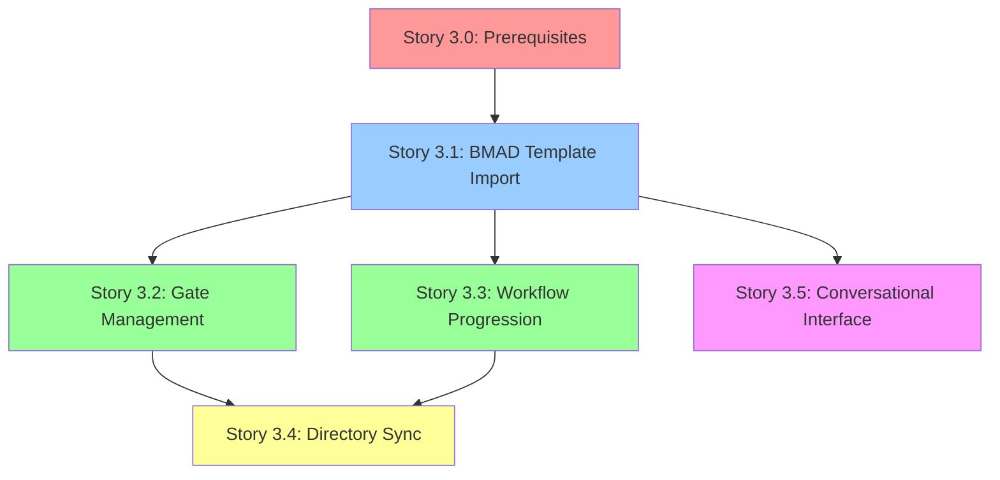

# Epic 3: Story Dependency Map

**Epic:** Epic 3 - BMAD Workflow Integration
**Created:** 2025-10-01
**Purpose:** Visual dependency map for Epic 3 story execution order

---

## Story Dependency Graph

---

## Execution Order

### Phase 0: Prerequisites (Week 1)

- **Story 3.0**: Epic 3 Prerequisites & Blockers Resolution
- **Duration**: 5 days
- **Blockers**: Must complete before any Epic 3 story
- **Status**: ✅ COMPLETE

### Sprint 1: Foundation & Core (Weeks 2-3)

1. **Story 3.1**: BMAD Template Import & External Service Setup (8-12h)
   - **Dependencies**: Story 3.0
   - **Blocks**: ALL other stories
   - **Can Run in Parallel**: None

2. **Story 3.2** + **Story 3.3** (Parallel Execution)
   - **Story 3.2**: Gate Management (8-12h)
   - **Story 3.3**: Workflow Progression (10-14h)
   - **Dependencies**: Story 3.1
   - **Can Run in Parallel**: Yes (independent codebases)
   - **Time Savings**: 10-14 hours

3. **Story 3.5**: Conversational Interface (8-12h)
   - **Dependencies**: Story 3.1
   - **Can Run in Parallel**: With Stories 3.2/3.3
   - **Note**: Frontend-focused, minimal backend overlap

### Sprint 2: Integration (Week 4-5)

4. **Story 3.4**: Claude Code Directory Sync (6-10h)
   - **Dependencies**: Stories 3.1, 3.2, 3.3
   - **Cannot Start Until**: Both 3.2 and 3.3 complete
   - **Reason**: Requires gate + workflow engines

---

## Critical Path Analysis

**Longest Path** (No Parallel Execution):

- 3.0 (5d) → 3.1 (12h) → 3.3 (14h) → 3.4 (10h) = ~6.5 days

**Optimized Path** (With Parallel Execution):

- 3.0 (5d) → 3.1 (12h) → [3.2 + 3.3 + 3.5 parallel] (14h) → 3.4 (10h) = ~6 days

**Time Savings**: 10-14 hours (1.5 days)

---

## Dependency Details

| Story | Depends On    | Blocks             | Parallel With | Priority |
| ----- | ------------- | ------------------ | ------------- | -------- |
| 3.0   | -             | ALL                | -             | P0       |
| 3.1   | 3.0           | 3.2, 3.3, 3.4, 3.5 | -             | P1       |
| 3.2   | 3.1           | 3.4                | 3.3, 3.5      | P1       |
| 3.3   | 3.1           | 3.4                | 3.2, 3.5      | P1       |
| 3.4   | 3.1, 3.2, 3.3 | -                  | -             | P2       |
| 3.5   | 3.1           | -                  | 3.2, 3.3      | P2       |

---

## Resource Allocation

### Solo Developer Scenario

- **Sprint 1 Week 1**: Story 3.0 (Prerequisites) - 5 days
- **Sprint 1 Week 2**: Story 3.1 (Foundation) - 2 days
- **Sprint 1 Week 3**: Stories 3.2 + 3.3 (Sequential) - 3 days
- **Sprint 2 Week 1**: Story 3.5 (Interface) - 2 days
- **Sprint 2 Week 2**: Story 3.4 (Directory Sync) - 2 days

**Total**: ~14 days (3 weeks)

### Two Developer Scenario

- **Sprint 1 Week 1**: Story 3.0 (Prerequisites) - 5 days [Both]
- **Sprint 1 Week 2**: Story 3.1 (Foundation) - 2 days [Dev 1]
- **Sprint 1 Week 3**:
  - Dev 1: Story 3.2 (Gates) - 2 days
  - Dev 2: Story 3.3 (Progression) - 2 days
- **Sprint 2 Week 1**:
  - Dev 1: Story 3.4 (Directory Sync) - 2 days
  - Dev 2: Story 3.5 (Interface) - 2 days

**Total**: ~11 days (2.5 weeks)

---

## Risk Mitigation

### High-Risk Dependencies

1. **Story 3.1 → All Stories**: Single point of failure
   - **Mitigation**: Complete 3.1 first, thorough testing
   - **Fallback**: Mock LLM providers for development

2. **Stories 3.2 + 3.3 → Story 3.4**: Convergence bottleneck
   - **Mitigation**: Clear interface contracts upfront
   - **Fallback**: Stub implementations for 3.4 development

### External Dependencies

1. **OpenAI/Anthropic API**: Service availability
   - **Mitigation**: OLLAMA fallback (local)
   - **Testing**: Mock responses for CI/CD

2. **MCP Protocol**: Specification changes
   - **Mitigation**: Version lock to 0.9.0
   - **Monitoring**: Check for protocol updates weekly

---

**Last Updated**: 2025-10-01
**Maintained By**: Product Owner (Sarah) / Scrum Master (Bob)
