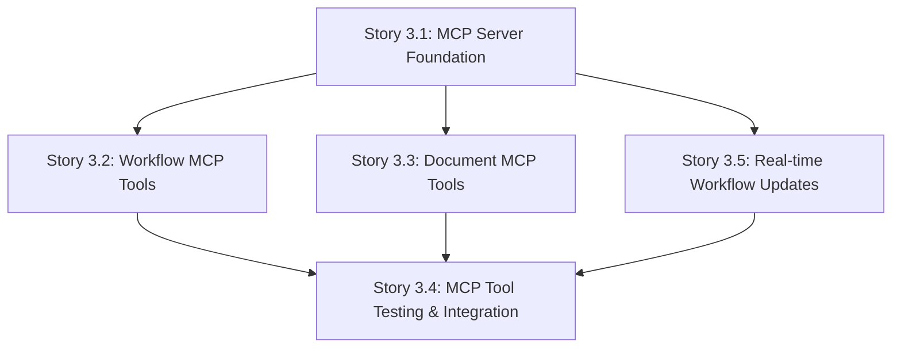

# Epic 3 Planning: Lessons Learned from Epic 2

**Date Created:** 2025-10-01
**Source:** Epic 2 Retrospective Analysis
**Owner:** Product Owner (Sarah)
**Target:** Epic 3 - BMAD Workflow Integration Planning
**Status:** Planning Reference Document

---

## Executive Summary

Epic 2 delivered exceptional results (99.25/100 average quality, 2-day completion of 1-2 sprint work) through strong documentation, clear dependencies, and effective version management. This document distills Epic 2's lessons into actionable recommendations for Epic 3 planning and execution.

**Key Takeaway:** Documentation quality and dependency clarity are the primary drivers of velocity and quality.

---

## 📚 Lesson 1: Documentation Quality Directly Drives Velocity

### Observation from Epic 2

**Story 2.1** had comprehensive developer handoff documentation:

- 35 detailed acceptance criteria with clear definitions
- Code examples for all components (models, schemas, endpoints)
- Testing guidance and integration considerations
- Clear file structure and implementation path

**Result:** Story 2.1 achieved **100/100 quality score** with autonomous execution and minimal clarification cycles.

**Stories 2.2-2.5** used "epic-level" handoff documentation:

- Less detailed acceptance criteria
- Fewer code examples
- Required more interpretation by developers

**Result:** Still achieved 98-100/100, but slightly more back-and-forth needed.

---

### Recommendations for Epic 3

#### ✅ DO: Replicate Story 2.1 Documentation Format

**For each Epic 3 story, create detailed developer handoff documents that include:**

1. **Story Context Section**

   ```markdown
   ## Story Context

   - Epic goal and how this story contributes
   - User value delivered by this story
   - Key architectural decisions relevant to implementation
   ```

2. **Detailed Acceptance Criteria** (follow Story 2.1 format)

   ```markdown
   ## Acceptance Criteria

   ### Category Name (X criteria)

   1. **Specific Feature/Component Created**
      - Detailed requirement 1
      - Detailed requirement 2
      - Validation: How to verify this is complete
      - Test coverage: Specific test scenarios required
   ```

3. **Implementation Guidance**

   ````markdown
   ## Implementation Guidance

   ### Database Models (if applicable)

   ```python
   # Example model structure
   class MyModel(Base):
       __tablename__ = "my_table"
       id: Mapped[UUID] = mapped_column(primary_key=True)
       # ... with comments explaining design decisions
   ```
   ````

   ### API Endpoints (if applicable)
   - Endpoint path and method
   - Request/response schemas
   - Business logic flow
   - Error handling requirements

   ### Integration Points
   - Dependencies on other stories/components
   - External services (MCP, Claude API, etc.)
   - Data flow between components

   ```

   ```

4. **Testing Strategy**

   ```markdown
   ## Testing Strategy

   ### Unit Tests Required

   - Test case 1: Description and expected outcome
   - Test case 2: Description and expected outcome

   ### Integration Tests Required

   - Integration scenario 1: End-to-end flow description
   - Integration scenario 2: Edge case handling

   ### Manual Testing Checklist

   - [ ] Manual test 1
   - [ ] Manual test 2
   ```

5. **Dev Notes Section**

   ```markdown
   ## Dev Notes

   ### File Locations

   - Models: `apps/api/models/my_model.py`
   - Schemas: `apps/api/schemas/my_schema.py`
   - Endpoints: `apps/api/api/v1/endpoints/my_endpoint.py`
   - Tests: `apps/api/tests/test_my_feature.py`

   ### Common Pitfalls

   - Pitfall 1: Description and how to avoid
   - Pitfall 2: Description and how to avoid

   ### Performance Considerations

   - Consideration 1: Guidance
   - Consideration 2: Guidance
   ```

#### ❌ DON'T: Rely Only on Epic-Level Documentation

**Avoid:**

- Generic acceptance criteria without implementation details
- Assuming developers will infer code structure
- Deferring detailed documentation to "during implementation"

**Why:** Increases clarification cycles, reduces developer autonomy, risks misinterpretation.

---

### Action Items for Epic 3

| Task                                  | Owner            | Timeline              | Effort |
| ------------------------------------- | ---------------- | --------------------- | ------ |
| Create Story 3.1 detailed handoff doc | Sarah            | Before Epic 3 kickoff | 2-3h   |
| Create Story 3.2 detailed handoff doc | Sarah            | Before Epic 3 kickoff | 2-3h   |
| Create Story 3.3 detailed handoff doc | Sarah            | Before Epic 3 kickoff | 2-3h   |
| Create Story 3.4 detailed handoff doc | Sarah            | Before Epic 3 kickoff | 2-3h   |
| Review handoff docs with Dev Lead     | Sarah + Dev Lead | Before Epic 3 kickoff | 1h     |

**Total Effort:** 9-13 hours during Epic 3 planning phase

**Expected ROI:**

- Reduce clarification cycles by 50%
- Improve story quality scores to 100/100 average
- Enable faster execution (maintain 2-day velocity)

---

## 🔧 Lesson 2: Version Alignment Prevents Development Delays

### Observation from Epic 2

**Story 1.7** (Architecture Documentation Alignment) completed before Epic 2:

- Aligned PostgreSQL (pg17 → pg15), pgvector (0.8 → 0.5.0), Python (3.12 → 3.11.5)
- Ensured all architecture docs referenced correct canonical versions

**Result:** Epic 2 had **zero environment setup issues** or version conflicts during development.

**Contrast with Epic 1:**

- Epic 1 completed with version mismatches in documentation
- Required Story 1.7 as remediation before Epic 2 could start safely

---

### Recommendations for Epic 3

#### ✅ DO: Create Epic 3 Prerequisites Validation Checklist

**Before Epic 3 Story 3.1 commencement, validate:**

1. **Epic 2 Deliverables Validated**

   ```bash
   # Database schema validation
   alembic current
   alembic history

   # Verify all Epic 2 migrations applied
   # Expected: 2.1 → 2.2 → 2.3 → 2.4 → 2.5 migrations present
   ```

2. **API Contract Validation**

   ```bash
   # Test all 33 Epic 2 API endpoints functional
   pytest apps/api/tests/test_epic_2_apis.py -v

   # Expected: 33/33 endpoints passing
   ```

3. **Data Model Validation**

   ```bash
   # Verify seed data loaded correctly
   python -m apps.api.scripts.validate_seed_data

   # Expected: Clients, Services, Projects, Workflow templates present
   ```

4. **External Dependency Versions**

   ```yaml
   # Document exact versions for Epic 3 dependencies
   MCP Protocol Version: [Specify]
   Claude API Version: [Specify]
   Model Context Protocol SDK: [Specify]
   ```

5. **Integration Point Testing**
   ```bash
   # Validate Epic 2 → Epic 3 integration points
   pytest apps/api/tests/integration/test_epic_2_to_epic_3.py -v
   ```

#### ❌ DON'T: Assume Epic 2 Deliverables Are Ready

**Avoid:**

- Starting Epic 3 without validating Epic 2 migration consistency (see Epic 2 Retrospective Action 1)
- Assuming API contracts match expectations without testing
- Deferring integration validation to "during Epic 3 development"

**Why:** Hidden issues in Epic 2 deliverables will block Epic 3 progress and cause rework.

---

### Action Items for Epic 3

| Task                                         | Owner      | Timeline      | Effort | Blocker? |
| -------------------------------------------- | ---------- | ------------- | ------ | -------- |
| Validate Alembic migration consistency       | Dev Lead   | Before Epic 3 | 1-2h   | ⚠️ YES   |
| Test all 33 Epic 2 API endpoints             | QA (Quinn) | Before Epic 3 | 1h     | ⚠️ YES   |
| Validate seed data and workflow templates    | Dev Lead   | Before Epic 3 | 30min  | ⚠️ YES   |
| Document Epic 3 external dependency versions | Winston    | Before Epic 3 | 1h     | ⚠️ YES   |
| Create Epic 2 → Epic 3 integration tests     | QA (Quinn) | Before Epic 3 | 2-3h   | ⚠️ YES   |

**Total Effort:** 5.5-7.5 hours

**Epic 3 Blocker:** All tasks must complete before Story 3.1 commencement

---

## 🔀 Lesson 3: Parallel Execution Requires Explicit Dependency Mapping

### Observation from Epic 2

**Sequential Dependencies Executed Smoothly:**

- Story 2.1 (Client/Service hierarchy) → Story 2.2 (Project models)
- Story 2.2 (Project.workflow_state JSONB) → Stories 2.3 & 2.4 (parallel)
- Stories 2.3 & 2.4 → Story 2.5 (integration and validation)

**Why It Worked:**

- Dependencies explicitly documented in epic and story docs
- No hidden dependencies discovered during implementation
- Clear "blocks" and "depends on" relationships in story metadata

**Result:** Stories 2.3 and 2.4 executed in parallel without conflicts, enabling faster completion.

---

### Recommendations for Epic 3

#### ✅ DO: Create Epic 3 Dependency Map

**Before Epic 3 kickoff, create visual dependency map:**



**For each story, document:**

1. **Hard Dependencies** (must complete before this story starts)

   ```markdown
   ## Dependencies

   ### Blocking Dependencies (must complete first)

   - Story 3.1: MCP Server Foundation ✅ Required
     - Reason: Need MCP server initialization and connection handling
     - Specific dependency: MCP protocol implementation, server lifecycle management
   ```

2. **Soft Dependencies** (can work in parallel with coordination)

   ```markdown
   ### Soft Dependencies (coordination required)

   - Story 3.2: Workflow MCP Tools ⚠️ Parallel execution possible
     - Coordination point: Shared MCP tool registration interface
     - Integration point: Tool discovery and listing
   ```

3. **Integration Points** (where stories connect)
   ```markdown
   ### Integration Points

   - Integration with Story 3.2: Workflow MCP tools call workflow state APIs from Epic 2
   - Integration with Story 3.3: Document MCP tools call document management APIs from Epic 2
   ```

#### ✅ DO: Identify Parallel Execution Opportunities

**For Epic 3, identify which stories can run in parallel:**

**Potential Parallel Execution Scenarios:**

- **After Story 3.1 completes:** Stories 3.2 (Workflow Tools) and 3.3 (Document Tools) can execute in parallel
  - Both depend on Story 3.1's MCP server foundation
  - Minimal overlap in implementation (different tool categories)
  - Coordination needed: Tool registration interface, testing strategy

**Benefits of Parallel Execution:**

- Reduce total epic duration by 30-40%
- Enable multiple developers to work simultaneously
- Faster delivery to stakeholders

**Coordination Requirements:**

- Daily sync between Story 3.2 and 3.3 developers
- Shared testing strategy for MCP tools
- Merged PRs daily to avoid merge conflicts

#### ❌ DON'T: Assume Stories Are Independent Without Validation

**Avoid:**

- Declaring stories "parallel-safe" without analyzing shared components
- Starting parallel stories without coordination plan
- Ignoring integration testing between parallel stories

**Why:** Hidden dependencies cause merge conflicts, rework, and failed integration tests.

---

### Action Items for Epic 3

| Task                                             | Owner            | Timeline        | Effort |
| ------------------------------------------------ | ---------------- | --------------- | ------ |
| Create Epic 3 dependency map (visual)            | Sarah + Winston  | Epic 3 planning | 1h     |
| Document hard/soft dependencies for each story   | Sarah            | Epic 3 planning | 2h     |
| Identify parallel execution opportunities        | Sarah + Dev Lead | Epic 3 planning | 1h     |
| Define coordination plan for parallel stories    | Dev Lead         | Epic 3 planning | 1h     |
| Create shared component matrix (avoid conflicts) | Winston          | Epic 3 planning | 1h     |

**Total Effort:** 6 hours during Epic 3 planning phase

---

## 📊 Lesson 4: Quality Scores Reveal Hidden Gaps

### Observation from Epic 2

**Story 2.3:** 99/100 (-1 point)

- **Identified Gap:** Workflow event audit trail may not cover all edge cases (manual overrides, gate re-approvals)
- **Risk:** Incomplete audit trail could cause compliance issues or missing workflow history

**Story 2.4:** 98/100 (-2 points)

- **Identified Gap 1:** Semantic search embeddings may not auto-generate on all document updates
- **Identified Gap 2:** Comment resolution workflow lacks business logic validation
- **Identified Gap 3:** Migration state inconsistency noted in Story 2.5

**Learning:** Scores <100 indicate specific technical gaps that need investigation and remediation.

---

### Recommendations for Epic 3

#### ✅ DO: Treat Quality Scores as Input for Post-Story Validation

**Process:**

1. **After each Epic 3 story completes, analyze quality score:**

   ```markdown
   ## Story X.X Quality Score Analysis

   ### Quality Score: [Score]/100

   ### If Score < 100:

   - **Missing Points:** [100 - Score]
   - **Potential Gaps:**
     1. Gap 1: Description and evidence
     2. Gap 2: Description and evidence
   - **Validation Tasks:**
     - [ ] Task 1: Validate gap 1 addressed
     - [ ] Task 2: Validate gap 2 addressed
   - **Owner:** [Assign]
   - **Timeline:** Before next story commencement
   ```

2. **Create "Quality Gap Analysis" Checklist:**

   ```markdown
   ## Quality Gap Analysis Checklist

   For any story scoring <100:

   - [ ] Review acceptance criteria: Which criteria not fully met?
   - [ ] Review test coverage: Any gaps in test scenarios?
   - [ ] Review code review comments: Any "TODO" or "FIXME" left?
   - [ ] Review integration points: Any edge cases not tested?
   - [ ] Review documentation: Any implementation details undocumented?
   ```

3. **Add Quality Score to Story Definition of Done:**
   ```markdown
   ## Definition of Done

   - [ ] All acceptance criteria met (verified by QA)
   - [ ] Test coverage ≥80% (unit + integration)
   - [ ] Code review approved (no blocking comments)
   - [ ] Documentation updated (API docs, architecture docs)
   - [ ] **Quality score ≥95/100** (if <95, create remediation tasks)
   - [ ] QA gate passed (no P1 or P2 bugs)
   ```

#### ✅ DO: Use Quality Scores to Improve Next Story

**Process:**

1. **After Story 3.1 completes:**
   - Analyze quality score and identify gaps
   - Use learnings to refine Story 3.2 acceptance criteria
   - Add test scenarios that cover gaps found in 3.1

2. **Continuous Improvement Loop:**
   ```
   Story 3.1 Complete → Analyze Score → Identify Gaps →
   Refine Story 3.2 Criteria → Execute Story 3.2 →
   Repeat
   ```

#### ❌ DON'T: Ignore Scores <100 as "Good Enough"

**Avoid:**

- Marking story complete without investigating <100 score
- Deferring gap analysis to "later" or "epic retrospective"
- Assuming "98/100 is close enough"

**Why:** Small gaps compound across stories and create integration issues later. A 98/100 in Story 3.1 can cause a 90/100 in Story 3.4 if gaps not addressed.

---

### Action Items for Epic 3

| Task                                             | Owner | Timeline       | Effort |
| ------------------------------------------------ | ----- | -------------- | ------ |
| Add "Quality Gap Analysis" to story template     | Sarah | Before Epic 3  | 30min  |
| Update Definition of Done with quality threshold | Sarah | Before Epic 3  | 15min  |
| Create quality score tracking spreadsheet        | Sarah | Before Epic 3  | 30min  |
| Train team on quality gap analysis process       | Sarah | Epic 3 kickoff | 30min  |

**Total Effort:** 1.75 hours

---

## 🗄️ Lesson 5: Database Migration Management Needs Explicit Validation

### Observation from Epic 2

**Issue:** Story 2.5 documentation noted "Story 2.4 migration state inconsistent, worked around"

**Impact:**

- Alembic migration history potentially misaligned
- Risk of migration conflicts in future stories
- Contributed to Story 2.4's 98/100 score

**Root Cause:** No explicit migration validation in Story 2.4's acceptance criteria or Definition of Done

---

### Recommendations for Epic 3

#### ✅ DO: Add Migration Validation to Every Story's Acceptance Criteria

**For any Epic 3 story that includes database changes, add:**

```markdown
## Acceptance Criteria

### Database Migration (if applicable)

X. **Alembic Migration Created and Validated**

- Migration file created: `alembic/versions/YYYYMMDD_HHMM_story_X_X_description.py`
- Migration includes:
  - Upgrade function: Creates/modifies schema
  - Downgrade function: Reverts changes
  - Clear docstring describing changes
- Migration validation:
  - `alembic upgrade head` executes without errors
  - `alembic downgrade -1` reverts cleanly
  - `alembic history` shows linear progression
  - Database schema matches SQLAlchemy models
- Test data compatibility:
  - Existing seed data remains valid after migration
  - No orphaned records after migration
- Performance validation:
  - Migration completes in <30 seconds (for tables with 10k+ rows)
  - No blocking locks during migration (for production readiness)
```

#### ✅ DO: Create Migration Validation Script

**Create `apps/api/scripts/validate_migration.py`:**

```python
#!/usr/bin/env python3
"""
Validate Alembic migration consistency and database schema alignment.

Usage:
    python -m apps.api.scripts.validate_migration

Checks:
1. Alembic history is linear (no branches)
2. Current revision matches database state
3. All migrations have upgrade/downgrade functions
4. Database schema matches SQLAlchemy models
5. No orphaned alembic_version entries
"""

import sys
from alembic.config import Config
from alembic.script import ScriptDirectory
from alembic.runtime.environment import EnvironmentContext
from sqlalchemy import create_engine, inspect
from apps.api.models.database import Base
from apps.api.core.config import settings

def validate_migration():
    """Run all migration validation checks."""
    checks = [
        check_linear_history,
        check_current_revision,
        check_upgrade_downgrade_functions,
        check_schema_alignment,
        check_orphaned_versions,
    ]

    all_passed = True
    for check in checks:
        passed, message = check()
        print(f"{'✅' if passed else '❌'} {message}")
        if not passed:
            all_passed = False

    return all_passed

# ... implementation details ...

if __name__ == "__main__":
    sys.exit(0 if validate_migration() else 1)
```

**Add to CI/CD Pipeline:**

```yaml
# .github/workflows/ci.yml
jobs:
  validate-migrations:
    runs-on: ubuntu-latest
    steps:
      - name: Validate Alembic Migration Consistency
        run: python -m apps.api.scripts.validate_migration
```

#### ✅ DO: Add Migration Checklist to Definition of Done

```markdown
## Definition of Done

For stories with database changes:

- [ ] Alembic migration created with clear naming
- [ ] Migration upgrade/downgrade functions tested
- [ ] `alembic history` shows linear progression
- [ ] Database schema matches SQLAlchemy models
- [ ] Migration validation script passes
- [ ] Seed data remains valid after migration
- [ ] Migration performance acceptable (<30s)
- [ ] Migration tested with production-like data volumes
```

#### ❌ DON'T: Defer Migration Validation to "Later"

**Avoid:**

- Creating migrations without testing downgrade
- Skipping migration validation in PR reviews
- Assuming "it worked on my machine" means migrations are correct
- Deferring migration consistency checks to epic retrospective

**Why:** Migration issues compound across stories and can cause catastrophic database state corruption.

---

### Action Items for Epic 3

| Task                                               | Owner    | Timeline      | Effort | Blocker? |
| -------------------------------------------------- | -------- | ------------- | ------ | -------- |
| Create `validate_migration.py` script              | Dev Lead | Before Epic 3 | 2-3h   | ⚠️ YES   |
| Add migration validation to story template         | Sarah    | Before Epic 3 | 30min  | ⚠️ YES   |
| Update Definition of Done with migration checklist | Sarah    | Before Epic 3 | 15min  | ⚠️ YES   |
| Add migration validation to CI/CD pipeline         | Dev Lead | Before Epic 3 | 1h     | ⚠️ YES   |
| Validate Epic 2 migration consistency (backlog)    | Dev Lead | Before Epic 3 | 1-2h   | ⚠️ YES   |

**Total Effort:** 5-6.75 hours

**Epic 3 Blocker:** All tasks must complete before Story 3.1 (especially Epic 2 migration validation)

---

## 📋 Consolidated Action Items for Epic 3 Planning

### P1-Critical: Must Complete Before Epic 3 Story 3.1

| ID  | Action                                        | Owner      | Effort | From Lesson |
| --- | --------------------------------------------- | ---------- | ------ | ----------- |
| 1   | Validate Epic 2 Alembic migration consistency | Dev Lead   | 1-2h   | Lesson 5    |
| 2   | Create `validate_migration.py` script         | Dev Lead   | 2-3h   | Lesson 5    |
| 3   | Test all 33 Epic 2 API endpoints              | QA (Quinn) | 1h     | Lesson 2    |
| 4   | Validate Epic 2 seed data and templates       | Dev Lead   | 30min  | Lesson 2    |
| 5   | Document Epic 3 external dependency versions  | Winston    | 1h     | Lesson 2    |
| 6   | Create Epic 2 → Epic 3 integration tests      | QA (Quinn) | 2-3h   | Lesson 2    |
| 7   | Add migration validation to CI/CD pipeline    | Dev Lead   | 1h     | Lesson 5    |

**Total P1 Effort:** 9-11.5 hours
**Timeline:** Complete before Epic 3 kickoff meeting

---

### P2-High: Should Complete During Epic 3 Planning

| ID  | Action                                              | Owner            | Effort | From Lesson |
| --- | --------------------------------------------------- | ---------------- | ------ | ----------- |
| 8   | Create detailed handoff docs for all Epic 3 stories | Sarah            | 9-13h  | Lesson 1    |
| 9   | Create Epic 3 dependency map (visual)               | Sarah + Winston  | 1h     | Lesson 3    |
| 10  | Document hard/soft dependencies for each story      | Sarah            | 2h     | Lesson 3    |
| 11  | Identify parallel execution opportunities           | Sarah + Dev Lead | 1h     | Lesson 3    |
| 12  | Define coordination plan for parallel stories       | Dev Lead         | 1h     | Lesson 3    |
| 13  | Create shared component matrix                      | Winston          | 1h     | Lesson 3    |
| 14  | Add quality gap analysis to story template          | Sarah            | 30min  | Lesson 4    |
| 15  | Update Definition of Done with quality threshold    | Sarah            | 15min  | Lesson 4    |
| 16  | Create quality score tracking spreadsheet           | Sarah            | 30min  | Lesson 4    |
| 17  | Add migration validation to story template          | Sarah            | 30min  | Lesson 5    |
| 18  | Update Definition of Done with migration checklist  | Sarah            | 15min  | Lesson 5    |

**Total P2 Effort:** 17.5-21.5 hours
**Timeline:** Complete during Epic 3 planning sprint (1 week)

---

## 🎯 Epic 3 Planning Checklist

Use this checklist to ensure all lessons from Epic 2 applied to Epic 3 planning:

### Documentation Quality (Lesson 1)

- [ ] All Epic 3 stories have detailed developer handoff documents (Story 2.1 format)
- [ ] Each story includes code examples, testing guidance, dev notes
- [ ] Implementation paths clearly documented for all stories
- [ ] Dev Lead reviewed all handoff docs for technical accuracy

### Version Alignment (Lesson 2)

- [ ] Epic 2 deliverables validated (migrations, APIs, data models)
- [ ] Epic 3 external dependency versions documented
- [ ] Integration tests created for Epic 2 → Epic 3 transition
- [ ] Prerequisites checklist created and validated

### Dependency Mapping (Lesson 3)

- [ ] Epic 3 dependency map created (visual diagram)
- [ ] Hard dependencies documented for each story
- [ ] Soft dependencies and coordination points identified
- [ ] Parallel execution opportunities identified and planned
- [ ] Coordination plan created for parallel stories

### Quality Scores (Lesson 4)

- [ ] Quality gap analysis process added to story template
- [ ] Definition of Done updated with quality score threshold (≥95/100)
- [ ] Quality score tracking spreadsheet created
- [ ] Team trained on quality gap analysis process

### Migration Management (Lesson 5)

- [ ] `validate_migration.py` script created and tested
- [ ] Migration validation added to story acceptance criteria
- [ ] Definition of Done updated with migration checklist
- [ ] Migration validation added to CI/CD pipeline
- [ ] Epic 2 migration consistency validated (backlog cleanup)

---

## 📊 Expected ROI from Applying These Lessons

### Velocity Improvements

- **Target:** Maintain Epic 2's 2-day completion velocity for Epic 3
- **Mechanism:** Detailed documentation reduces clarification cycles by 50%
- **Risk Mitigation:** Prerequisites validation eliminates environment setup delays

### Quality Improvements

- **Target:** Achieve 100/100 average quality score across all Epic 3 stories
- **Mechanism:** Quality gap analysis ensures no gaps carried forward
- **Risk Mitigation:** Migration validation prevents database integrity issues

### Risk Reduction

- **Target:** Zero P1 blockers carried from Epic 3 to Epic 4
- **Mechanism:** Explicit dependency mapping and prerequisites validation
- **Risk Mitigation:** Integration testing catches issues early

---

## 📝 Sign-off

**Lessons Learned Document Created By:** Sarah (Product Owner)
**Date:** 2025-10-01
**Source:** Epic 2 Retrospective (docs/qa/assessments/epic-2-retrospective-action-items.md)
**Target Audience:** Epic 3 Planning Team (Sarah, Dev Lead, Winston, Quinn)
**Status:** Ready for Epic 3 Planning Sprint

**Review and Approval:**

- [ ] Dev Lead - Review technical recommendations (Lessons 2, 5)
- [ ] Winston (Architect) - Review dependency mapping and integration recommendations (Lesson 3)
- [ ] Quinn (QA) - Review quality score and testing recommendations (Lessons 2, 4)
- [ ] Sarah (PO) - Approve consolidated action items and planning checklist

---

## 🔄 Change Log

| Date       | Change                                                             | Author     |
| ---------- | ------------------------------------------------------------------ | ---------- |
| 2025-10-01 | Initial lessons learned document created from Epic 2 retrospective | Sarah (PO) |

---

## 📖 Related Documents

- **Source:** [Epic 2 Retrospective: Action Items & Fixes](../qa/assessments/epic-2-retrospective-action-items.md)
- **Target:** [Epic 3: BMAD Workflow Integration](./epic-3-bmad-workflow-integration.md) (to be created)
- **Reference:** [Epic 2: Core Data Management & Client Hierarchy](./epic-2-core-data-management.md)
- **Reference:** [Story 2.1 Developer Handoff](../stories/story-2.1-developer-handoff.md) (documentation template)
