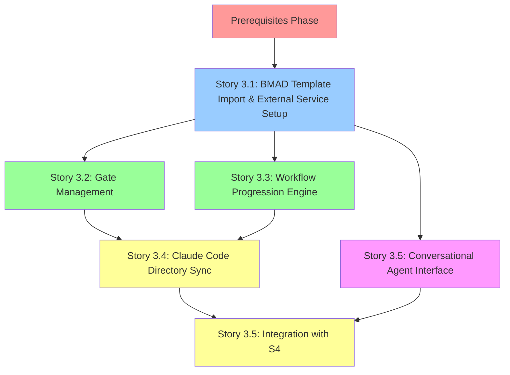

# Epic 3: BMAD Method Workflow Integration - Sprint Planning

**Date Created:** 2025-10-01
**Epic:** Epic 3 - BMAD Method Workflow Integration
**Sprint Planning Owner:** Product Owner (Sarah)
**Sprint Start Date:** [TBD - After Prerequisites Complete]
**Sprint Duration:** 2-3 weeks (estimated)
**Team:** Dev Lead, Winston (Architect), Quinn (QA), [Additional Developers as needed]

---

## 📋 Table of Contents

1. [Executive Summary](#executive-summary)
2. [Prerequisites & Blockers](#prerequisites--blockers)
3. [Epic 3 Story Breakdown](#epic-3-story-breakdown)
4. [Sprint Phases & Timeline](#sprint-phases--timeline)
5. [Capacity Planning](#capacity-planning)
6. [Risk Assessment](#risk-assessment)
7. [Success Metrics](#success-metrics)
8. [Sprint Ceremonies](#sprint-ceremonies)
9. [Appendices](#appendices)

---

## Executive Summary

### Epic 3 Goals

**Primary Goal:** Integrate BMAD Method workflow automation with Claude Code configuration files, implementing gate management, workflow progression tracking, and conversational agent interfaces for qualification assistance.

**Business Value:**

- Enable automated BMAD Method qualification workflows
- Reduce Product Owner administrative overhead by 30-50%
- Provide AI-assisted qualification guidance
- Maintain workflow audit trails for compliance

### Sprint Planning Overview

**Total Stories:** 5 stories (3.1 - 3.5)
**Estimated Effort:** 50-70 hours (1.5-2 sprints recommended)
**Prerequisites Effort:** 26.5-33 hours (must complete before sprint start)
**Parallel Execution Opportunity:** Stories 3.2 and 3.3 can execute in parallel after Story 3.1

**Recommended Approach:** 2-sprint execution with Prerequisites Phase (1 week) → Sprint 1 (Stories 3.1-3.3) → Sprint 2 (Stories 3.4-3.5)

---

## Prerequisites & Blockers

### ⚠️ CRITICAL: Must Complete Before Epic 3 Sprint Start

All prerequisites from Epic 2 retrospective and lessons learned must be completed before Story 3.1 commencement.

#### Phase 0: Prerequisites Validation (1 Week Before Sprint)

**Timeline:** 1 week
**Total Effort:** 26.5-33 hours
**Status:** 🔴 NOT STARTED

---

### Prerequisites Category 1: Epic 2 Technical Validation (P1-Critical)

**Epic 2 Blocker Resolution - Must Complete**

#### Prereq 1.1: Validate Alembic Migration Consistency ⚠️ EPIC 3 BLOCKER

**Issue:** Story 2.5 noted "Story 2.4 migration state inconsistent, worked around"

**Tasks:**

1. Run `alembic history` to review migration chain
2. Verify all migrations from Stories 2.1-2.5 applied correctly
3. Check for orphaned or duplicate migration files
4. Validate database schema matches canonical data models
5. Create corrective migration if needed

**Validation Commands:**

```bash
# Check migration history
alembic history

# Verify current revision
alembic current

# Validate all migrations applied
docker exec -it agentlab-postgres-1 psql -U agentlab -d agentlab -c "SELECT * FROM alembic_version;"

# Check for schema alignment
python -m apps.api.scripts.validate_schema  # Create this script if not exists
```

**Success Criteria:**

- Linear migration history with no branches
- All Epic 2 migrations present and applied
- Database schema matches SQLAlchemy models
- No orphaned alembic_version entries

**Owner:** Dev Lead
**Effort:** 1-2 hours
**Status:** 🔴 NOT STARTED
**Source:** Epic 2 Retrospective Action 1

---

#### Prereq 1.2: Story 2.3 Workflow Event Audit Trail Validation ⚠️ EPIC 3 BLOCKER

**Issue:** Story 2.3 scored 99/100, potential gap in WorkflowEvent coverage

**Tasks:**

1. Review all workflow state mutation paths (stage advance, gate approval, manual override)
2. Validate WorkflowEvent creation for all paths
3. Add integration tests for edge cases:
   - Manual override scenarios
   - Gate re-approval cycles
   - Concurrent workflow updates
4. Verify event metadata completeness (reason, notes, previous/new state)

**Test Scenarios:**

```python
# Test 1: Stage advancement creates event
# Test 2: Gate approval creates GATE_APPROVED event
# Test 3: Gate rejection creates GATE_REJECTED event
# Test 4: Manual override creates MANUAL_OVERRIDE event
# Test 5: Gate re-approval cycle (reject → approve) creates both events
# Test 6: Concurrent workflow updates handle race conditions
```

**Success Criteria:**

- 100% of workflow state mutations create WorkflowEvent
- Integration tests cover all event types (STAGE_ADVANCE, GATE_APPROVED, GATE_REJECTED, MANUAL_OVERRIDE)
- Event metadata includes all required context
- No race conditions in concurrent updates

**Owner:** Dev Lead + QA Engineer (Quinn)
**Effort:** 2-3 hours
**Status:** 🔴 NOT STARTED
**Source:** Epic 2 Retrospective Action 2

**Why Epic 3 Blocker:** Epic 3 Stories 3.2 and 3.3 build upon workflow event audit trails for gate management

---

#### Prereq 1.3: Story 2.4 Semantic Search Validation ⚠️ POTENTIALLY EPIC 3 BLOCKER

**Issue:** Story 2.4 scored 98/100, potential gap in embedding generation automation

**Tasks:**

1. Validate embedding generation triggers on all document content updates
2. Test scenarios:
   - Document creation with content
   - Document content update
   - Bulk document operations
   - Document rollback to previous version
3. Verify embeddings stored correctly in content_vector column
4. Test semantic search with various query types
5. Validate ivfflat index usage for performance

**Test Scenarios:**

```python
# Test 1: Create document → embedding generated
# Test 2: Update document content → embedding updated
# Test 3: Bulk create 100 documents → all embeddings generated
# Test 4: Rollback to previous version → embedding matches version
# Test 5: Semantic search "workflow automation" → returns relevant documents
# Test 6: Semantic search performance <500ms for 1000+ documents
```

**Success Criteria:**

- Embeddings generated automatically on all content changes
- Semantic search returns relevant results for test queries
- Performance acceptable (<500ms for similarity search with 1000+ documents)
- ivfflat index used correctly (verify with EXPLAIN ANALYZE)

**Owner:** Dev Lead + QA Engineer (Quinn)
**Effort:** 2-3 hours
**Status:** 🔴 NOT STARTED
**Source:** Epic 2 Retrospective Action 3

**Why Potentially Epic 3 Blocker:** If Story 3.4 (Claude Code synchronization) or 3.5 (Conversational Agent) depends on semantic document search

---

#### Prereq 1.4: Test All 33 Epic 2 API Endpoints ⚠️ EPIC 3 BLOCKER

**Issue:** Validate all Epic 2 API endpoints functional before Epic 3 integration

**Tasks:**

1. Run full Epic 2 test suite
2. Validate all 33 endpoints return expected responses
3. Test integration flows:
   - Client → Service → Project → Workflow → Document
   - Cascade delete operations
   - Workflow state transitions with document updates
4. Document any failures or unexpected behaviors

**Test Command:**

```bash
# Run all Epic 2 API tests
pytest apps/api/tests/test_clients.py -v
pytest apps/api/tests/test_services.py -v
pytest apps/api/tests/test_projects.py -v
pytest apps/api/tests/test_workflow.py -v
pytest apps/api/tests/test_documents.py -v

# Run integration tests
pytest apps/api/tests/integration/test_epic_2_flows.py -v

# Expected: 175+ tests passing, 0 failures
```

**Success Criteria:**

- All 33 Epic 2 API endpoints tested and passing
- Integration tests passing (client → service → project → workflow → document)
- Test coverage ≥80% confirmed
- No P1 or P2 bugs identified

**Owner:** QA Engineer (Quinn)
**Effort:** 1 hour
**Status:** 🔴 NOT STARTED
**Source:** Epic 3 Lessons Learned (Lesson 2)

---

#### Prereq 1.5: Validate Seed Data and Workflow Templates ⚠️ EPIC 3 BLOCKER

**Issue:** Epic 3 depends on seed data from Epic 2 (clients, services, projects, workflow templates)

**Tasks:**

1. Verify seed data loaded correctly
2. Validate BMAD workflow templates present
3. Test sample project workflows functional
4. Validate data integrity (foreign keys, constraints)

**Validation Commands:**

```bash
# Verify seed data
docker exec -it agentlab-postgres-1 psql -U agentlab -d agentlab -c "
SELECT
  (SELECT COUNT(*) FROM client) as clients,
  (SELECT COUNT(*) FROM service) as services,
  (SELECT COUNT(*) FROM project) as projects,
  (SELECT COUNT(*) FROM workflow_event) as workflow_events;
"

# Expected output:
# clients: 3-5
# services: 10-15
# projects: 20-25
# workflow_events: 50+
```

**Success Criteria:**

- 3-5 sample clients present
- 10-15 sample services present
- 20-25 sample projects present
- BMAD workflow templates configured correctly
- Sample workflow progressions functional

**Owner:** Dev Lead
**Effort:** 30 minutes
**Status:** 🔴 NOT STARTED
**Source:** Epic 3 Lessons Learned (Lesson 2)

---

### Prerequisites Category 2: Epic 3 Technical Foundation (P1-Critical)

**Epic 3-Specific Infrastructure Setup**

#### Prereq 2.1: Document Epic 3 External Dependency Versions ⚠️ EPIC 3 BLOCKER

**Issue:** Epic 3 introduces new external dependencies (MCP Protocol, OpenAI API, Anthropic Claude API, OLLAMA)

**Tasks:**

1. Document exact versions for all Epic 3 dependencies:
   - MCP Protocol version
   - Python MCP SDK version
   - OpenAI API version (python library)
   - Anthropic Claude API version (python library)
   - OLLAMA version (if using)
2. Add to canonical versions document
3. Update `requirements.txt` with pinned versions

**Canonical Versions to Document:**

```yaml
# Epic 3 External Dependencies
MCP Protocol: [Specify - research latest stable]
Python MCP SDK: [Specify - e.g., mcp==0.x.x]
OpenAI Python Library: openai==1.x.x
Anthropic Python Library: anthropic==0.x.x
OLLAMA: [Specify version if using]
```

**Success Criteria:**

- All Epic 3 external dependency versions documented
- Versions added to `docs/EPIC-3-CANONICAL-VERSIONS.md` (create new)
- `requirements.txt` updated with pinned versions
- No version conflicts with Epic 1/2 dependencies

**Owner:** Winston (Architect)
**Effort:** 1 hour
**Status:** 🔴 NOT STARTED
**Source:** Epic 3 Lessons Learned (Lesson 2)

---

#### Prereq 2.2: Create Epic 2 → Epic 3 Integration Tests ⚠️ EPIC 3 BLOCKER

**Issue:** Need integration tests to validate Epic 2 deliverables work correctly with Epic 3 requirements

**Tasks:**

1. Create `tests/integration/test_epic_2_to_epic_3.py`
2. Test scenarios:
   - Epic 3 can read Epic 2 workflow state
   - Epic 3 can create workflow events via Epic 2 APIs
   - Epic 3 can query documents from Epic 2
   - Epic 3 can update project workflow states
3. Validate integration points documented

**Test Scenarios:**

```python
# Test 1: Epic 3 workflow engine reads Epic 2 workflow_state JSONB
# Test 2: Epic 3 gate management creates WorkflowEvent in Epic 2 tables
# Test 3: Epic 3 conversational agent queries Epic 2 document API
# Test 4: Epic 3 progression engine updates Epic 2 project workflow_state
# Test 5: Epic 3 Claude Code sync reads/writes Epic 2 documents
```

**Success Criteria:**

- 5+ integration tests created and passing
- All Epic 2 → Epic 3 integration points covered
- Tests run in CI/CD pipeline
- Integration test documentation created

**Owner:** QA Engineer (Quinn)
**Effort:** 2-3 hours
**Status:** 🔴 NOT STARTED
**Source:** Epic 3 Lessons Learned (Lesson 2)

---

#### Prereq 2.3: Create Migration Validation Script ⚠️ EPIC 3 BLOCKER

**Issue:** Need automated migration validation to prevent Epic 2 Story 2.4 migration inconsistency from recurring

**Tasks:**

1. Create `apps/api/scripts/validate_migration.py`
2. Implement validation checks:
   - Linear migration history (no branches)
   - Current revision matches database state
   - All migrations have upgrade/downgrade functions
   - Database schema matches SQLAlchemy models
   - No orphaned alembic_version entries
3. Add to CI/CD pipeline
4. Add to story Definition of Done

**Script Implementation:**

```python
#!/usr/bin/env python3
"""
Validate Alembic migration consistency.

Checks:
1. Linear history (no branches)
2. Current revision matches database
3. Upgrade/downgrade functions present
4. Schema alignment with models
5. No orphaned versions
"""

# ... implementation ...

if __name__ == "__main__":
    sys.exit(0 if validate_migration() else 1)
```

**Success Criteria:**

- Script created and executable
- All validation checks implemented
- Script added to CI/CD pipeline
- Documentation created for usage

**Owner:** Dev Lead
**Effort:** 2-3 hours
**Status:** 🔴 NOT STARTED
**Source:** Epic 3 Lessons Learned (Lesson 5)

---

#### Prereq 2.4: Add Migration Validation to CI/CD Pipeline

**Issue:** Migration validation should run automatically on every PR

**Tasks:**

1. Update `.github/workflows/ci.yml`
2. Add migration validation step:
   ```yaml
   - name: Validate Alembic Migration Consistency
     run: python -m apps.api.scripts.validate_migration
   ```
3. Test pipeline with intentional migration issues
4. Document failure scenarios

**Success Criteria:**

- Migration validation runs on every PR
- Pipeline fails if migration inconsistencies detected
- Clear error messages for migration issues

**Owner:** Dev Lead
**Effort:** 1 hour
**Status:** 🔴 NOT STARTED
**Source:** Epic 3 Lessons Learned (Lesson 5)

---

### Prerequisites Category 3: Process & Documentation (P2-High)

**Can start during Prerequisites Phase, continue in parallel with Sprint 1**

#### Prereq 3.1: Create Detailed Handoff Docs for All Epic 3 Stories

**Issue:** Stories 2.2-2.5 used "epic-level" handoff vs detailed docs for Story 2.1

**Tasks:**

1. Create `docs/stories/story-3.1-developer-handoff.md` (Story 3.1)
2. Create `docs/stories/story-3.2-developer-handoff.md` (Story 3.2)
3. Create `docs/stories/story-3.3-developer-handoff.md` (Story 3.3)
4. Create `docs/stories/story-3.4-developer-handoff.md` (Story 3.4)
5. Create `docs/stories/story-3.5-developer-handoff.md` (Story 3.5)

**Use Story 2.1 Format:**

- Story context and user value
- Detailed acceptance criteria (with code examples)
- Implementation guidance (models, schemas, endpoints)
- Testing strategy (unit, integration, manual)
- Dev notes (file locations, pitfalls, performance)

**Success Criteria:**

- All 5 Epic 3 stories have detailed handoff documents
- Format matches Story 2.1 quality
- Dev Lead reviewed for technical accuracy
- Code examples provided for all components

**Owner:** Sarah (Product Owner)
**Effort:** 2-3 hours per story = 10-15 hours total
**Status:** 🟡 PLANNING PHASE
**Source:** Epic 2 Retrospective Action 5, Epic 3 Lessons Learned (Lesson 1)

**Can Execute:** During Prerequisites Phase (parallel with technical validation)

---

#### Prereq 3.2: Create Epic 3 Dependency Map (Visual)

**Issue:** Need explicit dependency mapping to enable parallel execution

**Tasks:**

1. Create visual dependency map (Mermaid diagram)
2. Document hard dependencies (blocking)
3. Document soft dependencies (coordination required)
4. Identify parallel execution opportunities

**Dependency Map:**



**Parallel Execution Opportunities:**

- **After Story 3.1:** Stories 3.2 and 3.3 can execute in parallel
- **Coordination Required:** Shared workflow state machine interface

**Success Criteria:**

- Visual dependency map created
- Hard/soft dependencies documented
- Parallel execution plan defined
- Team understands coordination points

**Owner:** Sarah + Winston
**Effort:** 1 hour
**Status:** 🔴 NOT STARTED
**Source:** Epic 3 Lessons Learned (Lesson 3)

---

#### Prereq 3.3: Update Story Template with Quality Gap Analysis

**Issue:** Stories scoring <100 need systematic gap analysis

**Tasks:**

1. Add "Quality Gap Analysis" section to story template
2. Update Definition of Done with quality threshold (≥95/100)
3. Create quality score tracking spreadsheet
4. Train team on quality gap analysis process

**Updated Definition of Done:**

```markdown
## Definition of Done

- [ ] All acceptance criteria met (verified by QA)
- [ ] Test coverage ≥80% (unit + integration)
- [ ] Code review approved (no blocking comments)
- [ ] Documentation updated (API docs, architecture docs)
- [ ] **Quality score ≥95/100** (if <95, create remediation tasks)
- [ ] QA gate passed (no P1 or P2 bugs)
- [ ] Migration validation passed (if database changes)
```

**Success Criteria:**

- Story template updated
- Definition of Done updated
- Quality tracking spreadsheet created
- Team trained on process

**Owner:** Sarah
**Effort:** 1.75 hours
**Status:** 🔴 NOT STARTED
**Source:** Epic 3 Lessons Learned (Lesson 4)

---

#### Prereq 3.4: Update Story Template with Migration Validation

**Issue:** Database changes need explicit migration validation in acceptance criteria

**Tasks:**

1. Add migration validation section to story template
2. Update Definition of Done with migration checklist
3. Document migration validation process

**Migration Validation Template:**

```markdown
## Acceptance Criteria

### Database Migration (if applicable)

X. **Alembic Migration Created and Validated**

- Migration file created with clear naming
- Upgrade/downgrade functions tested
- `alembic history` shows linear progression
- Database schema matches SQLAlchemy models
- Migration validation script passes
- Seed data remains valid after migration
- Migration performance acceptable (<30s)
```

**Success Criteria:**

- Story template updated with migration section
- Definition of Done includes migration checklist
- Migration validation process documented

**Owner:** Sarah
**Effort:** 45 minutes
**Status:** 🔴 NOT STARTED
**Source:** Epic 3 Lessons Learned (Lesson 5)

---

### Prerequisites Summary

| Category                            | Tasks        | Total Effort          | Status             | Epic 3 Blocker?         |
| ----------------------------------- | ------------ | --------------------- | ------------------ | ----------------------- |
| **P1: Epic 2 Technical Validation** | 5 tasks      | 6.5-9 hours           | 🔴 NOT STARTED     | ⚠️ YES                  |
| **P1: Epic 3 Technical Foundation** | 4 tasks      | 6-8 hours             | 🔴 NOT STARTED     | ⚠️ YES                  |
| **P2: Process & Documentation**     | 4 tasks      | 13.75-17.75 hours     | 🟡 PLANNING        | ❌ NO (Can parallelize) |
| **TOTAL**                           | **13 tasks** | **26.25-34.75 hours** | **🔴 NOT STARTED** | -                       |

**Critical Path:** P1 tasks must complete before Story 3.1 commencement
**Recommended Timeline:** 1 week (5 business days) with 2 developers + 1 QA engineer

---

## Epic 3 Story Breakdown

### Story 3.1: BMAD Template Import & External Service Setup

**Goal:** Set up external service integrations (MCP, OpenAI, Anthropic, OLLAMA) and implement BMAD workflow template import from Claude Code configuration files.

**Estimated Effort:** 12-16 hours
**Dependencies:** Prerequisites Phase complete
**Blocks:** Stories 3.2, 3.3, 3.4, 3.5

**Key Deliverables:**

1. MCP protocol client integration (Python MCP SDK)
2. OpenAI API client setup with error handling
3. Anthropic Claude API client setup with rate limiting
4. OLLAMA local LLM configuration (optional)
5. Template import parser for Claude Code configuration files
6. Workflow template storage and versioning
7. External template validation against BMAD Method standards

**Acceptance Criteria:** 20+ criteria covering MCP setup, API integrations, template parsing, error handling

**Developer Handoff:** `docs/stories/story-3.1-developer-handoff.md` (to be created in Prerequisites Phase)

**Critical Success Factors:**

- All external services authenticated and functional
- Template import handles malformed configuration files gracefully
- Fallback procedures when external services unavailable
- Comprehensive error logging for debugging

**Risks:**

- External API rate limits (mitigation: implement retry logic with exponential backoff)
- Claude Code MCP protocol version compatibility (mitigation: version detection and adapter pattern)
- OLLAMA installation complexity (mitigation: make optional, document thoroughly)

---

### Story 3.2: Gate Management & User/Agent Responsibility Framework

**Goal:** Implement gate management interface with clear human/agent responsibility boundaries and gate approval workflow.

**Estimated Effort:** 10-14 hours
**Dependencies:** Story 3.1 complete
**Blocks:** Story 3.4
**Can Execute in Parallel With:** Story 3.3 (coordination required on workflow state machine interface)

**Key Deliverables:**

1. Gate approval/rejection interface for human reviewers
2. Human-only actions clearly identified (gate decisions, API key provision)
3. Agent-only actions clearly identified (code generation, config parsing)
4. Comment capture for gate rejections
5. Reviewer assignment and notification system
6. Gate history and audit trail
7. Gate dependency and sequencing logic

**Acceptance Criteria:** 18+ criteria covering gate UI, human/agent boundaries, audit trails, notifications

**Developer Handoff:** `docs/stories/story-3.2-developer-handoff.md` (to be created in Prerequisites Phase)

**Critical Success Factors:**

- Clear visual distinction between human and agent actions
- Gate approval workflow prevents unauthorized bypasses
- Audit trail captures all gate decisions with context
- Notifications reach assigned reviewers reliably

**Risks:**

- UI complexity for gate review interface (mitigation: user testing with PO)
- Authorization logic for gate approvals (mitigation: role-based access control)

**Parallel Execution Coordination:**

- **Shared Component:** Workflow state machine interface
- **Coordination Plan:** Daily sync with Story 3.3 developer, shared interface design session before implementation
- **Integration Point:** Story 3.2 gate management calls Story 3.3 progression engine after approval

---

### Story 3.3: Workflow Progression Engine

**Goal:** Implement workflow state machine with automatic progression triggers, conditional branching, and completion detection.

**Estimated Effort:** 10-14 hours
**Dependencies:** Story 3.1 complete
**Blocks:** Story 3.4
**Can Execute in Parallel With:** Story 3.2 (coordination required on workflow state machine interface)

**Key Deliverables:**

1. Workflow state machine implementation
2. Automatic progression triggers (based on gate approvals)
3. Conditional workflow branching (based on project type, requirements)
4. Workflow completion detection
5. Progression analytics and reporting
6. Workflow state validation and error recovery

**Acceptance Criteria:** 16+ criteria covering state machine, progression rules, branching logic, analytics

**Developer Handoff:** `docs/stories/story-3.3-developer-handoff.md` (to be created in Prerequisites Phase)

**Critical Success Factors:**

- State machine prevents invalid state transitions
- Automatic progression triggers fire reliably
- Conditional branching logic matches BMAD Method requirements
- Analytics provide meaningful insights for POs

**Risks:**

- State machine complexity (mitigation: comprehensive state diagram, unit tests for all transitions)
- Race conditions in concurrent progression (mitigation: database-level locking)

**Parallel Execution Coordination:**

- **Shared Component:** Workflow state machine interface
- **Coordination Plan:** Daily sync with Story 3.2 developer, shared interface design session before implementation
- **Integration Point:** Story 3.3 progression engine triggered by Story 3.2 gate approvals

---

### Story 3.4: Claude Code Directory Synchronization

**Goal:** Implement bidirectional file synchronization between AgentLab and Claude Code project directories.

**Estimated Effort:** 10-14 hours
**Dependencies:** Stories 3.2 and 3.3 complete (needs gate management and progression engine)
**Blocks:** None (can complete without Story 3.5)

**Key Deliverables:**

1. On-demand file synchronization
2. Bidirectional sync (AgentLab ↔ Claude Code)
3. Conflict detection and resolution workflow
4. File change monitoring (filesystem watchers)
5. Sync status reporting and progress indicators
6. Error handling for sync failures

**Acceptance Criteria:** 15+ criteria covering sync operations, conflict handling, monitoring, error recovery

**Developer Handoff:** `docs/stories/story-3.4-developer-handoff.md` (to be created in Prerequisites Phase)

**Critical Success Factors:**

- File synchronization maintains data integrity (no corruption)
- Conflict detection prevents data loss
- Sync status visible to users in real-time
- Performance acceptable for large project directories

**Risks:**

- File system permission issues (mitigation: clear error messages, documentation)
- Large file performance (mitigation: chunked uploads, progress indicators)
- Conflict resolution complexity (mitigation: user-driven resolution workflow)

---

### Story 3.5: Conversational Agent Interface

**Goal:** Integrate LLM providers (OpenAI, Anthropic, OLLAMA) for conversational qualification assistance with project-level context.

**Estimated Effort:** 12-16 hours
**Dependencies:** Story 3.1 complete (needs LLM integrations), Story 3.4 helpful but not required
**Blocks:** None (final story)

**Key Deliverables:**

1. Unified LLM provider interface (OpenAI, Anthropic, OLLAMA)
2. Project-level conversational context management
3. Qualification workflow assistance (prompts, guidance)
4. Conversation history and context preservation
5. Agent response quality monitoring
6. Token usage tracking and limits

**Acceptance Criteria:** 18+ criteria covering LLM integrations, context management, quality monitoring, token tracking

**Developer Handoff:** `docs/stories/story-3.5-developer-handoff.md` (to be created in Prerequisites Phase)

**Critical Success Factors:**

- Multiple LLM providers work seamlessly (failover between providers)
- Context management prevents conversation drift
- Response quality meets user expectations
- Token usage stays within budget constraints

**Risks:**

- LLM provider rate limits (mitigation: implement rate limiting, caching, failover)
- Response quality variability (mitigation: prompt engineering, quality monitoring)
- Context window limits (mitigation: context summarization, selective history)

---

### Epic 3 Story Summary

| Story     | Title                                         | Effort     | Dependencies           | Can Parallelize?             | Priority |
| --------- | --------------------------------------------- | ---------- | ---------------------- | ---------------------------- | -------- |
| 3.1       | BMAD Template Import & External Service Setup | 12-16h     | Prerequisites complete | ❌ No (foundation)           | P1       |
| 3.2       | Gate Management & User/Agent Framework        | 10-14h     | Story 3.1              | ✅ Yes (with 3.3)            | P1       |
| 3.3       | Workflow Progression Engine                   | 10-14h     | Story 3.1              | ✅ Yes (with 3.2)            | P1       |
| 3.4       | Claude Code Directory Sync                    | 10-14h     | Stories 3.2, 3.3       | ❌ No                        | P1       |
| 3.5       | Conversational Agent Interface                | 12-16h     | Story 3.1              | ⚠️ Partial (can start early) | P2       |
| **TOTAL** | **5 stories**                                 | **54-74h** | -                      | -                            | -        |

**Parallel Execution Savings:** Stories 3.2 and 3.3 in parallel saves 10-14 hours
**Adjusted Total with Parallelization:** 44-60 hours

---

## Sprint Phases & Timeline

### Recommended Approach: 2-Sprint Execution with Prerequisites Phase

**Total Duration:** 3-4 weeks (Prerequisites + 2 Sprints)

---

### Phase 0: Prerequisites Validation (Week 1)

**Duration:** 5 business days (1 week)
**Team:** Dev Lead (full-time), QA Engineer (50%), Sarah (20%), Winston (10%)
**Effort:** 26.5-33 hours

**Objectives:**

1. Complete all P1-Critical prerequisites (Epic 2 validation, Epic 3 foundation)
2. Complete P2-High documentation prerequisites (story handoff docs, templates)
3. Validate Epic 3 ready to commence

**Day 1-2 (Monday-Tuesday):**

- Dev Lead: Prereq 1.1 (Alembic validation), Prereq 1.5 (Seed data validation)
- Dev Lead: Prereq 2.3 (Migration validation script)
- QA (Quinn): Prereq 1.4 (Test all 33 Epic 2 APIs)
- Winston: Prereq 2.1 (Document external dependency versions)

**Day 3-4 (Wednesday-Thursday):**

- Dev Lead + QA: Prereq 1.2 (Workflow event audit trail validation)
- Dev Lead + QA: Prereq 1.3 (Semantic search validation)
- Dev Lead: Prereq 2.4 (Add migration validation to CI/CD)
- QA (Quinn): Prereq 2.2 (Create Epic 2 → Epic 3 integration tests)

**Day 5 (Friday):**

- Sarah: Prereq 3.1 (Create all 5 story handoff docs) - START, continue into weekend/next week
- Sarah: Prereq 3.2 (Create dependency map)
- Sarah: Prereq 3.3 (Update story template with quality gap analysis)
- Sarah: Prereq 3.4 (Update story template with migration validation)
- Team: Prerequisites validation meeting, Sprint 1 planning

**Prerequisites Completion Criteria:**

- [ ] All P1-Critical tasks complete (13 tasks)
- [ ] All Epic 2 validation issues resolved
- [ ] Epic 3 external dependency versions documented
- [ ] Migration validation script created and in CI/CD
- [ ] All 5 Epic 3 story handoff docs created
- [ ] Story templates updated with quality and migration validation
- [ ] Team trained on new processes
- [ ] Sprint 1 planned and ready to start Monday

---

### Sprint 1: Stories 3.1, 3.2, 3.3 (Week 2-3)

**Duration:** 10 business days (2 weeks)
**Team:** Dev Lead, Developer 2 (if available), QA Engineer, Sarah (as needed)
**Effort:** 32-44 hours development + 10-15 hours testing/QA

**Sprint Goal:** Deliver BMAD template import, gate management, and workflow progression engine with full integration.

**Week 2 (Days 1-5):**

**Story 3.1: BMAD Template Import & External Service Setup (12-16h)**

- **Owner:** Dev Lead (primary developer)
- **Days 1-3:** MCP integration, OpenAI/Anthropic API setup, template parser
- **Days 4-5:** Template validation, error handling, integration testing

**Week 3 (Days 6-10):**

**Story 3.2: Gate Management (10-14h) - PARALLEL**

- **Owner:** Developer 2 (if available) OR Dev Lead (if solo)
- **Days 6-7:** Gate approval UI/API, human/agent boundaries
- **Days 8-9:** Reviewer assignment, notifications, audit trail
- **Day 10:** Integration with Story 3.3, testing

**Story 3.3: Workflow Progression Engine (10-14h) - PARALLEL**

- **Owner:** Dev Lead (if solo) OR Developer 2
- **Days 6-7:** State machine implementation, progression rules
- **Days 8-9:** Conditional branching, completion detection
- **Day 10:** Integration with Story 3.2, testing

**Coordination:**

- **Daily sync** between Story 3.2 and 3.3 developers (15 minutes)
- **Shared interface design session** on Day 6 morning (1 hour)
- **Integration testing** on Day 10 (both stories complete)

**QA Activities:**

- Days 4-5: Story 3.1 QA testing
- Days 9-10: Stories 3.2 and 3.3 QA testing
- Day 10: Sprint 1 integration testing

**Sprint 1 Review & Retrospective:** End of Week 3 (Friday afternoon)

---

### Sprint 2: Stories 3.4, 3.5 (Week 4)

**Duration:** 5-10 business days (1-2 weeks, depending on complexity)
**Team:** Dev Lead, Developer 2 (if available), QA Engineer, Sarah (as needed)
**Effort:** 22-30 hours development + 8-12 hours testing/QA

**Sprint Goal:** Deliver Claude Code synchronization and conversational agent interface, completing Epic 3.

**Week 4 (Days 1-5):**

**Story 3.4: Claude Code Directory Sync (10-14h)**

- **Owner:** Dev Lead
- **Days 1-2:** Bidirectional sync implementation, conflict detection
- **Days 3-4:** File monitoring, sync status reporting
- **Day 5:** Error handling, integration testing

**Story 3.5: Conversational Agent Interface (12-16h)**

- **Owner:** Developer 2 OR Dev Lead (sequential if solo)
- **Days 1-3 (or 6-8 if sequential):** LLM provider integration, context management
- **Days 4-5 (or 9-10 if sequential):** Conversation history, quality monitoring, token tracking

**Note:** If Developer 2 available, Stories 3.4 and 3.5 can overlap partially (3.5 can start on Day 3 while 3.4 continues). If solo Dev Lead, execute sequentially.

**QA Activities:**

- Days 4-5: Story 3.4 QA testing
- Days 5-7 (or later if sequential): Story 3.5 QA testing
- Final day: Epic 3 integration testing (all stories together)

**Sprint 2 Review & Retrospective:** End of Week 4 (or Week 5 if 2-week sprint)

---

### Epic 3 Retrospective (After Sprint 2 Complete)

**Duration:** 2-3 hours
**Participants:** Full team (Dev Lead, Developer 2, QA, Sarah, Winston)

**Agenda:**

1. Review Epic 3 metrics (velocity, quality scores, blockers)
2. Analyze quality scores for Stories 3.1-3.5 (identify gaps if <100)
3. Discuss parallel execution effectiveness (Stories 3.2/3.3 coordination)
4. Capture lessons learned for Epic 4
5. Identify action items for Epic 4 prerequisites

**Deliverable:** `docs/qa/assessments/epic-3-retrospective-action-items.md`

---

## Capacity Planning

### Team Composition

**Recommended Team:**

- **Dev Lead:** Full-time (40 hours/week) - Primary developer, architecture decisions
- **Developer 2 (if available):** Full-time (40 hours/week) - Parallel execution for Stories 3.2/3.3
- **QA Engineer (Quinn):** 50% allocation (20 hours/week) - Testing, validation, QA gates
- **Architect (Winston):** 10% allocation (4 hours/week) - Architecture guidance, reviews
- **Product Owner (Sarah):** 20% allocation (8 hours/week) - Acceptance criteria clarification, story reviews

**Total Team Capacity:**

- **Prerequisites Phase (1 week):** Dev Lead (40h) + QA (20h) + Sarah (8h) + Winston (4h) = 72 hours available vs 26.5-33 hours required ✅ Sufficient
- **Sprint 1 (2 weeks):** Dev Lead (80h) + Dev2 (80h if available) + QA (40h) = 200 hours available vs 47-59 hours required ✅ Sufficient
- **Sprint 2 (1-2 weeks):** Dev Lead (40-80h) + Dev2 (40-80h if available) + QA (20-40h) = 100-200 hours available vs 30-42 hours required ✅ Sufficient

---

### Solo Developer Scenario (No Developer 2)

**Adjustments if only Dev Lead available:**

**Sprint 1 Adjustment:**

- Execute Stories 3.1, 3.2, 3.3 **sequentially** instead of parallel
- Story 3.1: Days 1-3 (12-16h)
- Story 3.2: Days 4-6 (10-14h)
- Story 3.3: Days 7-9 (10-14h)
- Integration & Testing: Day 10
- **Total Sprint 1 Duration:** 2 weeks (same, but more compressed)

**Sprint 2 Adjustment:**

- Execute Stories 3.4 and 3.5 **sequentially**
- Story 3.4: Days 1-3 (10-14h)
- Story 3.5: Days 4-7 (12-16h)
- Integration & Testing: Days 8-10
- **Total Sprint 2 Duration:** 2 weeks (instead of 1 week)

**Total Epic 3 Duration (Solo):** 4-5 weeks (Prerequisites + 2-week Sprint 1 + 2-week Sprint 2)

---

### Velocity Assumptions

**Based on Epic 2 Performance:**

- Epic 2 completed in ~2 days with estimated 40-56 hours
- Actual velocity: ~20-28 hours per day (compressed, high-intensity execution)
- Epic 3 estimated: 54-74 hours → Expected ~3-4 days if maintaining Epic 2 velocity

**Conservative Planning:**

- Assume normal velocity: ~6-8 hours productive work per developer per day
- Account for coordination overhead: ~10% time for meetings, syncs, blockers
- Account for integration complexity: ~20% buffer for Epic 3 (external services, new technologies)

**Realistic Timeline:**

- Prerequisites Phase: 1 week (as planned)
- Sprint 1: 2 weeks (as planned, includes parallel execution)
- Sprint 2: 1-2 weeks (depending on solo vs team)
- **Total: 4-5 weeks for Epic 3 completion**

---

## Risk Assessment

### High-Impact Risks

#### Risk 1: External Service Dependencies (OpenAI, Anthropic, MCP)

**Likelihood:** Medium
**Impact:** High (blocks Stories 3.1, 3.5)

**Description:** External API rate limits, service outages, or authentication issues could block development progress.

**Mitigation:**

1. **Prerequisites Phase:** Obtain API keys for OpenAI and Anthropic, test authentication before Sprint 1
2. **Story 3.1:** Implement retry logic with exponential backoff for all external API calls
3. **Story 3.1:** Create mock external services for testing without API calls
4. **Story 3.5:** Implement multi-provider failover (OpenAI → Anthropic → OLLAMA)
5. **Monitoring:** Track API usage and rate limits, alert on approaching limits

**Contingency Plan:** If external services unavailable, prioritize Stories 3.2, 3.3, 3.4 (can progress without external LLMs for gate management and workflow)

---

#### Risk 2: Claude Code MCP Protocol Compatibility

**Likelihood:** Medium
**Impact:** High (blocks Story 3.1, impacts 3.4)

**Description:** MCP protocol version mismatches or undocumented behavior could cause integration failures.

**Mitigation:**

1. **Prerequisites Phase:** Research MCP protocol version, document canonical version
2. **Prereq 2.1:** Document exact Python MCP SDK version, test basic MCP operations
3. **Story 3.1:** Implement version detection, create adapter pattern for version differences
4. **Story 3.1:** Comprehensive error logging for MCP operations
5. **Testing:** Create integration tests with real Claude Code instances

**Contingency Plan:** If MCP integration fails, implement file-based synchronization as fallback (Story 3.4 can work with filesystem operations instead of MCP)

---

#### Risk 3: Parallel Execution Coordination Issues (Stories 3.2 & 3.3)

**Likelihood:** Medium
**Impact:** Medium (delays Sprint 1, potential rework)

**Description:** Insufficient coordination between Story 3.2 and 3.3 developers could cause interface mismatches, merge conflicts, or rework.

**Mitigation:**

1. **Prereq 3.2:** Create dependency map showing coordination points
2. **Sprint 1 Day 6:** Shared interface design session (1 hour) before implementation
3. **Sprint 1 Daily:** 15-minute sync between Story 3.2 and 3.3 developers
4. **Code Review:** Both developers review each other's interface changes
5. **Integration Testing:** Dedicated Day 10 for integration testing

**Contingency Plan:** If coordination fails, execute Stories 3.2 and 3.3 sequentially (adds 10-14 hours to Sprint 1)

---

#### Risk 4: Prerequisites Phase Overruns

**Likelihood:** Medium
**Impact:** High (delays Sprint 1 start)

**Description:** Epic 2 validation issues or Epic 3 infrastructure setup could take longer than estimated 26.5-33 hours.

**Mitigation:**

1. **Time Boxing:** Strict 1-week limit for Prerequisites Phase
2. **Daily Check-ins:** Dev Lead reports progress daily, escalates blockers immediately
3. **Prioritization:** P1-Critical tasks must complete; P2-High can slip to Sprint 1 if needed
4. **Team Support:** Winston and Sarah available for unblocking (quick response time)

**Contingency Plan:**

- If Prerequisites Phase overruns by 2-3 days, extend to 1.5 weeks
- If major blockers found (e.g., Epic 2 migration corruption), escalate to full team for resolution
- Worst case: Delay Sprint 1 start by 1 week, reassess Epic 3 scope

---

#### Risk 5: Quality Score <95 Requiring Rework

**Likelihood:** Low-Medium
**Impact:** Medium (delays subsequent stories, Epic 4)

**Description:** Stories scoring <95/100 may require remediation work before subsequent stories can proceed.

**Mitigation:**

1. **Prereq 3.3:** Updated Definition of Done with quality threshold ≥95/100
2. **In-Sprint:** Quality gap analysis for any story <100
3. **Testing:** Comprehensive testing strategy in each story handoff doc
4. **Code Review:** Strict code review process, checklist for common gaps
5. **QA Involvement:** QA Engineer involved during development, not just at end

**Contingency Plan:**

- If story scores <95, allocate 2-4 hours for remediation before next story starts
- If multiple stories score <95, schedule "quality sprint" to address all gaps before Epic 4

---

### Medium-Impact Risks

#### Risk 6: Semantic Search Performance Issues

**Likelihood:** Low
**Impact:** Medium (affects Story 3.5 quality)

**Description:** pgvector semantic search may not meet <500ms performance target with 1000+ documents.

**Mitigation:**

1. **Prereq 1.3:** Validate semantic search performance before Epic 3
2. **Story 3.5:** Performance testing with realistic document volumes
3. **Optimization:** Add database indexes, tune ivfflat parameters
4. **Caching:** Implement embedding cache for frequently queried documents

**Contingency Plan:** If performance unacceptable, implement fallback to keyword search

---

#### Risk 7: File Synchronization Conflicts

**Likelihood:** Medium
**Impact:** Low-Medium (affects Story 3.4 user experience)

**Description:** Bidirectional sync between AgentLab and Claude Code could cause data loss or corruption if conflicts not handled properly.

**Mitigation:**

1. **Story 3.4:** Comprehensive conflict detection algorithm
2. **Story 3.4:** User-driven conflict resolution workflow (manual review)
3. **Testing:** Test conflict scenarios (concurrent edits, large files, network interruptions)
4. **Backups:** Automatic backups before sync operations

**Contingency Plan:** If conflict resolution too complex, implement one-way sync (AgentLab → Claude Code only) as MVP

---

### Risk Summary Table

| Risk                            | Likelihood | Impact     | Mitigation Priority | Owner              |
| ------------------------------- | ---------- | ---------- | ------------------- | ------------------ |
| External Service Dependencies   | Medium     | High       | P1                  | Dev Lead           |
| Claude Code MCP Compatibility   | Medium     | High       | P1                  | Dev Lead + Winston |
| Parallel Execution Coordination | Medium     | Medium     | P2                  | Dev Lead + Dev2    |
| Prerequisites Phase Overruns    | Medium     | High       | P1                  | Dev Lead + Sarah   |
| Quality Score <95 Rework        | Low-Medium | Medium     | P2                  | QA + Dev Lead      |
| Semantic Search Performance     | Low        | Medium     | P3                  | Dev Lead           |
| File Sync Conflicts             | Medium     | Low-Medium | P3                  | Dev Lead           |

---

## Success Metrics

### Epic 3 Success Criteria

**Functional Metrics:**

- [ ] All 5 stories completed with acceptance criteria met
- [ ] Quality scores: Average ≥98/100, minimum ≥95/100
- [ ] Test coverage: ≥80% across all Epic 3 components
- [ ] All BMAD workflow templates import correctly
- [ ] Gate management interface fully functional
- [ ] Workflow progression engine operational
- [ ] Claude Code synchronization working reliably
- [ ] Conversational agent provides helpful assistance

**Quality Metrics:**

- [ ] Zero P1 bugs carried forward to Epic 4
- [ ] ≤3 P2 bugs total across Epic 3
- [ ] Code review approval rate ≥95%
- [ ] Test pass rate ≥98%

**Performance Metrics:**

- [ ] Template import <5 seconds for standard BMAD templates
- [ ] Gate approval workflow <200ms response time
- [ ] Workflow progression <500ms for standard transitions
- [ ] File synchronization <10 seconds for typical project directories
- [ ] Conversational agent response <5 seconds (excluding LLM latency)

**Integration Metrics:**

- [ ] Epic 2 → Epic 3 integration tests 100% passing
- [ ] External service integrations operational (OpenAI, Anthropic, MCP)
- [ ] Zero data integrity issues (foreign keys, constraints validated)

**Process Metrics:**

- [ ] All 5 stories have detailed developer handoff documents (Story 2.1 format)
- [ ] Migration validation passes for all database changes
- [ ] Quality gap analysis performed for all stories
- [ ] Prerequisites Phase completed in ≤1 week

---

### Velocity & Efficiency Metrics

**Target Velocity:** Maintain Epic 2's efficiency (completed 1-2 sprint work in 2 days)
**Realistic Velocity:** 54-74 hours over 2-3 sprints (4-5 weeks including Prerequisites)

**Efficiency Targets:**

- **Story Lead Time:** Average 2-3 days per story (development + testing)
- **Clarification Cycles:** <2 per story (enabled by detailed handoff docs)
- **Rework Rate:** <5% of total effort
- **Parallel Execution Savings:** 10-14 hours saved (Stories 3.2/3.3 in parallel)

---

## Sprint Ceremonies

### Prerequisites Phase Ceremonies

**Daily Stand-up:** 15 minutes, 9:00 AM

- What completed yesterday?
- What working on today?
- Any blockers?

**Prerequisites Review Meeting:** End of Week 1 (Friday), 2 hours

- Review all P1-Critical task completion
- Demo validation scripts and tests
- Review Epic 3 story handoff documents
- Sprint 1 planning and kickoff

---

### Sprint 1 Ceremonies

**Sprint Planning:** Monday Week 2, 2 hours

- Review Sprint 1 goal and stories (3.1, 3.2, 3.3)
- Review detailed handoff documents
- Assign story owners
- Define coordination plan for parallel execution

**Daily Stand-up:** 15 minutes, 9:00 AM

- Standard format (what done, what today, blockers)
- **Additional for Stories 3.2/3.3:** Interface changes discussion

**Parallel Coordination Sync:** 15 minutes, 2:00 PM (Days 6-10 only)

- Story 3.2 and 3.3 developers sync
- Discuss interface changes, integration points
- Resolve conflicts or design questions

**Mid-Sprint Review:** Wednesday Week 2, 1 hour

- Review Story 3.1 progress (should be near completion)
- Address any blockers for Stories 3.2/3.3 parallel execution
- Adjust plan if needed

**Sprint 1 Review:** Friday Week 3, 1.5 hours

- Demo Stories 3.1, 3.2, 3.3 functionality
- Review quality scores and test results
- Acceptance by Product Owner (Sarah)

**Sprint 1 Retrospective:** Friday Week 3, 1 hour

- What went well? (celebrate parallel execution success)
- What could improve?
- Action items for Sprint 2

---

### Sprint 2 Ceremonies

**Sprint Planning:** Monday Week 4, 1.5 hours

- Review Sprint 2 goal and stories (3.4, 3.5)
- Review detailed handoff documents
- Assign story owners (solo or team)

**Daily Stand-up:** 15 minutes, 9:00 AM

- Standard format

**Mid-Sprint Review:** Wednesday Week 4, 30 minutes

- Review progress (should be near Story 3.4 completion)
- Address blockers for Story 3.5

**Sprint 2 Review:** End of Week 4 (or Week 5), 1.5 hours

- Demo Stories 3.4, 3.5 functionality
- Demo full Epic 3 integration (all stories working together)
- Review quality scores and test results
- Acceptance by Product Owner (Sarah)

**Sprint 2 Retrospective:** End of Week 4 (or Week 5), 1 hour

- What went well?
- What could improve?
- Action items for Epic 4

---

### Epic 3 Retrospective (Post-Sprint 2)

**Epic 3 Final Retrospective:** 1 week after Sprint 2 completion, 2-3 hours

- Review entire Epic 3 (Prerequisites + 2 Sprints)
- Analyze velocity, quality scores, parallel execution effectiveness
- Capture lessons learned for Epic 4
- Create `docs/qa/assessments/epic-3-retrospective-action-items.md`
- Identify Epic 4 prerequisites

---

## Appendices

### Appendix A: Prerequisites Checklist (Detailed)

**Use this checklist to track Prerequisites Phase progress:**

#### P1-Critical: Epic 2 Technical Validation

- [ ] **Prereq 1.1:** Alembic migration consistency validated
  - [ ] `alembic history` shows linear progression
  - [ ] All Epic 2 migrations applied
  - [ ] Database schema matches SQLAlchemy models
  - [ ] No orphaned alembic_version entries
  - [ ] Corrective migration created if needed

- [ ] **Prereq 1.2:** Workflow event audit trail validated
  - [ ] All workflow state mutations create WorkflowEvent
  - [ ] Integration tests for manual override scenarios
  - [ ] Integration tests for gate re-approval cycles
  - [ ] Integration tests for concurrent workflow updates
  - [ ] Event metadata completeness verified

- [ ] **Prereq 1.3:** Semantic search validated
  - [ ] Embeddings generated on document creation
  - [ ] Embeddings updated on content changes
  - [ ] Bulk operations generate embeddings correctly
  - [ ] Semantic search returns relevant results
  - [ ] Performance <500ms for 1000+ documents

- [ ] **Prereq 1.4:** All 33 Epic 2 API endpoints tested
  - [ ] Client management endpoints (5) passing
  - [ ] Service management endpoints (5) passing
  - [ ] Contact management endpoints (2) passing
  - [ ] Service categories endpoints (2) passing
  - [ ] Project management endpoints (7) passing
  - [ ] Workflow management endpoints (4) passing
  - [ ] Document management endpoints (8) passing
  - [ ] Integration tests passing

- [ ] **Prereq 1.5:** Seed data and templates validated
  - [ ] 3-5 sample clients present
  - [ ] 10-15 sample services present
  - [ ] 20-25 sample projects present
  - [ ] BMAD workflow templates configured
  - [ ] Sample workflow progressions functional

#### P1-Critical: Epic 3 Technical Foundation

- [ ] **Prereq 2.1:** External dependency versions documented
  - [ ] MCP Protocol version specified
  - [ ] Python MCP SDK version specified
  - [ ] OpenAI Python library version pinned
  - [ ] Anthropic Python library version pinned
  - [ ] OLLAMA version specified (if using)
  - [ ] `docs/EPIC-3-CANONICAL-VERSIONS.md` created
  - [ ] `requirements.txt` updated with pinned versions

- [ ] **Prereq 2.2:** Epic 2 → Epic 3 integration tests created
  - [ ] Test: Epic 3 reads Epic 2 workflow_state
  - [ ] Test: Epic 3 creates WorkflowEvent via Epic 2 APIs
  - [ ] Test: Epic 3 queries documents from Epic 2
  - [ ] Test: Epic 3 updates project workflow_state
  - [ ] Test: Epic 3 Claude Code sync reads/writes Epic 2 documents
  - [ ] Tests added to CI/CD pipeline

- [ ] **Prereq 2.3:** Migration validation script created
  - [ ] `apps/api/scripts/validate_migration.py` created
  - [ ] Linear history check implemented
  - [ ] Current revision check implemented
  - [ ] Upgrade/downgrade functions check implemented
  - [ ] Schema alignment check implemented
  - [ ] Orphaned versions check implemented
  - [ ] Script executable and tested

- [ ] **Prereq 2.4:** Migration validation added to CI/CD
  - [ ] `.github/workflows/ci.yml` updated
  - [ ] Migration validation step added
  - [ ] Pipeline tested with intentional issues
  - [ ] Clear error messages for failures

#### P2-High: Process & Documentation

- [ ] **Prereq 3.1:** Detailed handoff docs created for all Epic 3 stories
  - [ ] `docs/stories/story-3.1-developer-handoff.md` (12-16 pages)
  - [ ] `docs/stories/story-3.2-developer-handoff.md` (10-14 pages)
  - [ ] `docs/stories/story-3.3-developer-handoff.md` (10-14 pages)
  - [ ] `docs/stories/story-3.4-developer-handoff.md` (10-14 pages)
  - [ ] `docs/stories/story-3.5-developer-handoff.md` (12-16 pages)
  - [ ] Dev Lead reviewed all handoff docs for technical accuracy

- [ ] **Prereq 3.2:** Dependency map created
  - [ ] Visual dependency map (Mermaid diagram)
  - [ ] Hard dependencies documented for each story
  - [ ] Soft dependencies documented
  - [ ] Parallel execution opportunities identified
  - [ ] Coordination plan defined for Stories 3.2/3.3

- [ ] **Prereq 3.3:** Story template updated with quality gap analysis
  - [ ] Quality gap analysis section added
  - [ ] Definition of Done updated (≥95/100 threshold)
  - [ ] Quality score tracking spreadsheet created
  - [ ] Team trained on quality gap analysis process

- [ ] **Prereq 3.4:** Story template updated with migration validation
  - [ ] Migration validation section added to template
  - [ ] Definition of Done updated with migration checklist
  - [ ] Migration validation process documented

---

### Appendix B: Epic 3 Story Acceptance Criteria Counts

**Estimate based on Epic 2 patterns and Epic 3 complexity:**

| Story     | Estimated Acceptance Criteria | Categories                                                                                     |
| --------- | ----------------------------- | ---------------------------------------------------------------------------------------------- |
| 3.1       | 20-25                         | MCP setup, API integrations, template parsing, error handling, validation                      |
| 3.2       | 18-22                         | Gate UI/API, human/agent boundaries, audit trails, notifications, reviewer assignment          |
| 3.3       | 16-20                         | State machine, progression rules, branching logic, analytics, completion detection             |
| 3.4       | 15-18                         | Sync operations, conflict handling, monitoring, error recovery, status reporting               |
| 3.5       | 18-22                         | LLM integrations, context management, quality monitoring, token tracking, conversation history |
| **TOTAL** | **87-107 AC**                 | **5 stories**                                                                                  |

**Average:** 17-21 acceptance criteria per story (slightly higher than Epic 2 due to external integrations complexity)

---

### Appendix C: Epic 3 API Endpoints Estimate

**New API endpoints to be created in Epic 3:**

| Category             | Endpoints | Story         |
| -------------------- | --------- | ------------- |
| Template Management  | 5         | 3.1           |
| Gate Management      | 6         | 3.2           |
| Workflow Progression | 5         | 3.3           |
| File Synchronization | 4         | 3.4           |
| Conversational Agent | 6         | 3.5           |
| **TOTAL**            | **26**    | **5 stories** |

**Integration with Epic 2:** Epic 3 endpoints will call Epic 2 APIs (33 endpoints) extensively for workflow and document operations.

---

### Appendix D: Testing Strategy Summary

**Unit Tests:**

- Target coverage: ≥80% for all Epic 3 components
- Mock external services (OpenAI, Anthropic, MCP) for fast execution
- Test all error handling paths

**Integration Tests:**

- Epic 2 → Epic 3 integration (workflow state, documents, events)
- External service integrations (with real APIs in staging environment)
- End-to-end workflows (template import → gate management → progression → sync)

**Manual Tests:**

- Gate approval UI/UX testing (Sarah + QA)
- Claude Code synchronization with real projects
- Conversational agent quality testing (multiple queries, context management)

**Performance Tests:**

- Template import <5 seconds
- Gate approval <200ms
- Workflow progression <500ms
- File sync <10 seconds
- Agent response <5 seconds (excluding LLM latency)

---

### Appendix E: Epic 4 Lookahead

**Prerequisites for Epic 4 (Portfolio Dashboard & Core UI):**

- Epic 3 complete with quality scores ≥95/100
- All Epic 3 integration tests passing
- Authentication system planned (depends on tech stack: NextAuth, Auth0, custom?)
- Frontend framework validated (Next.js 13.4.19+, React 18.2.0+, TypeScript 5.1.6)
- UI component library selected (Shadcn UI, Tailwind CSS confirmed)

**Epic 4 Dependencies:**

- Epic 3 workflow APIs (gate management, progression engine)
- Epic 2 client/project APIs
- Epic 3 conversational agent (for AI assistance in dashboard)

**Epic 4 Estimated Effort:** 60-80 hours (2-3 sprints) - UI development typically more time-consuming

---

### Appendix F: Contact Information & Escalation

**Team Contacts:**

**Dev Lead:** [Name, Email, Slack]

- Primary developer for Epic 3
- Escalation: Technical blockers, architecture decisions

**Developer 2:** [Name, Email, Slack] (if available)

- Secondary developer for parallel execution
- Escalation: Story-specific technical issues

**QA Engineer (Quinn):** [Email, Slack]

- Testing and validation
- Escalation: Quality issues, test failures, acceptance criteria clarification

**Architect (Winston):** [Email, Slack]

- Architecture guidance and reviews
- Escalation: Integration design, external service selection, performance optimization

**Product Owner (Sarah):** [Email, Slack]

- Acceptance criteria, prioritization, business logic
- Escalation: Scope questions, business requirement clarification, priority conflicts

**Escalation Path:**

1. Dev Lead → Architect (technical issues)
2. Dev Lead → Product Owner (scope/requirements)
3. Product Owner → Leadership (resource/timeline issues)

---

## 📝 Sign-off

**Sprint Planning Completed By:** Sarah (Product Owner)
**Date:** 2025-10-01
**Next Milestone:** Prerequisites Phase Kickoff (after sign-off)
**Status:** 🟡 AWAITING APPROVAL

**Approval Required From:**

- [ ] **Dev Lead** - Commit to Prerequisites Phase and Sprint 1/2 execution, validate effort estimates
- [ ] **QA Engineer (Quinn)** - Commit to testing schedule, validate QA effort estimates
- [ ] **Architect (Winston)** - Approve Epic 3 technical approach, commit to review availability
- [ ] **Product Owner (Sarah)** - Final approval to proceed with Prerequisites Phase

**Once Approved:**

- [ ] Schedule Prerequisites Phase Kickoff Meeting (1 hour)
- [ ] Create Prerequisites Phase tracking board/spreadsheet
- [ ] Assign Prerequisites Phase tasks to owners
- [ ] Begin Prerequisites Phase (Week 1)

---

## 🔄 Change Log

| Date       | Version | Change                                                          | Author     |
| ---------- | ------- | --------------------------------------------------------------- | ---------- |
| 2025-10-01 | 1.0     | Initial Epic 3 sprint planning document created                 | Sarah (PO) |
| 2025-10-01 | 1.0     | Incorporated Epic 2 retrospective action items as prerequisites | Sarah (PO) |
| 2025-10-01 | 1.0     | Incorporated Epic 3 lessons learned from Epic 2                 | Sarah (PO) |
| 2025-10-01 | 1.0     | Defined 2-sprint execution plan with prerequisites phase        | Sarah (PO) |

---

**Related Documents:**

- [Epic 3: BMAD Method Workflow Integration](./epic-3-bmad-workflow-integration.md)
- [Epic 3 Lessons Learned from Epic 2](./epic-3-lessons-learned-from-epic-2.md)
- [Epic 2 Retrospective: Action Items & Fixes](../qa/assessments/epic-2-retrospective-action-items.md)
- [Epic 1 Retrospective: Action Items & Fixes](../qa/assessments/epic-1-retrospective-action-items.md)
