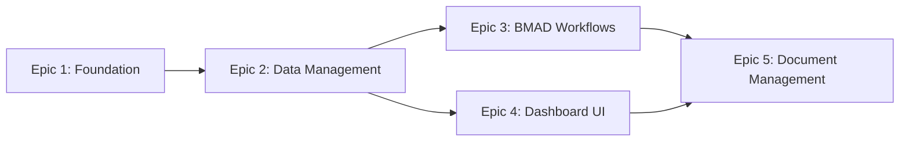

# Epic Documentation Index

This folder contains all epic documentation for the AgentLab project. Epics represent major feature sets and follow a specific dependency sequence for implementation.

## 📋 Epic Implementation Sequence

**Implementation Order**: Epic 1 → Epic 2 → (Epic 3 & Epic 4 in parallel) → Epic 5

---

## 📚 Epic Documentation

### [⚡ Epic 1: Foundation & Infrastructure Setup](./epic-1-foundation-infrastructure.md)
**Status**: ✅ PO Validated - Ready for development
**Goal**: Establish foundational development environment and infrastructure
**Duration**: 2-3 weeks
**Team**: Full stack developers, DevOps

**Key Deliverables**:
- Complete project scaffolding with explicit setup commands
- Docker-compose environment with IaC (Terraform modules)
- Testing framework with mock services (pytest, Jest, Playwright)
- Version-pinned dependencies with conflict resolution
- Development environment validation (<10 minute setup)

**Success Criteria**:
- Docker environment starts in <2 minutes
- All dependencies install without conflicts
- Test suite passes with >80% coverage
- IaC templates deploy successfully

---

### [📊 Epic 2: Core Data Management & Client Hierarchy](./epic-2-core-data-management.md)
**Status**: ✅ PO Validated - Dependent on Epic 1
**Goal**: Implement fundamental data management system
**Duration**: 2-3 weeks
**Team**: Backend developers, Database specialists

**Key Deliverables**:
- Client → Service → Project hierarchy with contact management
- PostgreSQL database with pgvector extension
- BMAD workflow state tracking and progression
- Comprehensive seed data (3-5 clients, 10-15 services, 20-25 projects)
- Data validation with Pydantic models and referential integrity

**Success Criteria**:
- All CRUD operations under 200ms response time
- Data validation prevents invalid states
- Migration scripts handle schema evolution
- Seed data creates realistic development environment

---

### [🔄 Epic 3: BMAD Method Workflow Integration](./epic-3-bmad-workflow-integration.md)
**Status**: ✅ PO Validated - Parallel with Epic 4
**Goal**: Integrate BMAD Method workflow automation with Claude Code
**Duration**: 3-4 weeks
**Team**: Backend developers, AI integration specialists

**Key Deliverables**:
- MCP protocol client for Claude Code integration
- External API setup (OpenAI, Anthropic, OLLAMA) with fallbacks
- Gate management interface with human oversight required
- Workflow template import and validation
- User/Agent responsibility framework clearly implemented

**Success Criteria**:
- MCP connection establishes within 2 seconds
- External API integrations work with proper error handling
- Gate approvals require human confirmation
- Workflow state transitions follow BMAD Method rules

---

### [📱 Epic 4: Portfolio Dashboard & Core UI](./epic-4-portfolio-dashboard-ui.md)
**Status**: ✅ PO Validated - Parallel with Epic 3
**Goal**: Implement user-facing dashboard interface
**Duration**: 3-4 weeks
**Team**: Frontend developers, UX designers

**Key Deliverables**:
- Dashboard-first navigation optimized for 10-25 concurrent projects
- Authentication and user session management
- Portfolio overview with activity feed and status visualization
- Client and project management interfaces
- Responsive design with WCAG AA accessibility compliance

**Success Criteria**:
- Page loads under 2 seconds with 25+ projects
- Context switching between projects under 3 seconds
- Accessibility testing passes with screen readers
- Mobile/tablet compatibility validated

---

### [📝 Epic 5: Document Management & Bilingual Support](./epic-5-document-management-bilingual.md)
**Status**: ✅ PO Validated - Dependent on all previous epics
**Goal**: Implement comprehensive document management with bilingual support
**Duration**: 2-3 weeks
**Team**: Frontend developers, Content management specialists

**Key Deliverables**:
- GitHub-style markdown rendering with change tracking
- Mermaid diagram integration for architecture documentation
- French/English bilingual document management
- Document synchronization with Claude Code projects
- Export capabilities for development handoff

**Success Criteria**:
- Markdown rendering supports all GitHub features
- Mermaid diagrams render correctly in all browsers
- Language switching works seamlessly
- Document sync completes within 10 seconds

---

## 📊 Epic Summary Statistics

| Epic | Stories | Estimated Weeks | Dependencies | Status |
|------|---------|----------------|--------------|--------|
| Epic 1 | 5 | 2-3 | None | ✅ Ready |
| Epic 2 | 5 | 2-3 | Epic 1 | ✅ Ready |
| Epic 3 | 5 | 3-4 | Epic 2 | ✅ Ready |
| Epic 4 | 5 | 3-4 | Epic 2 | ✅ Ready |
| Epic 5 | 5 | 2-3 | Epic 3, 4 | ✅ Ready |

**Total Estimated Duration**: 12-17 weeks (sequential) or 8-11 weeks (with parallel execution)

---

## 🎯 Critical Path Analysis

**Sequential Path**: Epic 1 → Epic 2 → Epic 3 → Epic 5 (10-13 weeks)
**Parallel Optimization**: Epic 1 → Epic 2 → (Epic 3 ‖ Epic 4) → Epic 5 (8-11 weeks)

**Recommended Approach**: Use parallel execution for Epics 3 and 4 to optimize delivery timeline while maintaining quality standards.

---

## 🔄 Epic Review Process

Each epic must pass the following validation before proceeding:

1. **Technical Review**: Architecture and implementation approach validated
2. **PO Validation**: Requirements completeness and scope alignment confirmed
3. **QA Review**: Testing strategy and quality gates defined
4. **Stakeholder Sign-off**: Business requirements and acceptance criteria approved

**Current Status**: All epics have passed PO Master Checklist validation and are approved for implementation.

---

## 📞 Epic Ownership

- **Epic 1-2**: Backend Team Lead + DevOps Specialist
- **Epic 3**: Backend Team Lead + AI Integration Specialist
- **Epic 4**: Frontend Team Lead + UX Designer
- **Epic 5**: Frontend Team Lead + Content Management Specialist

**Cross-Epic Coordination**: Product Owner (Sarah) ensures dependency management and timeline coordination across all epics.