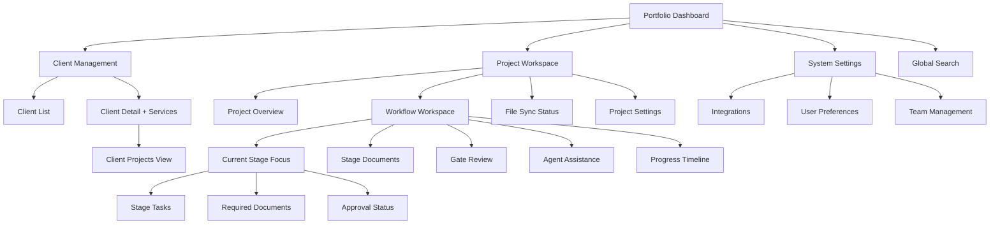
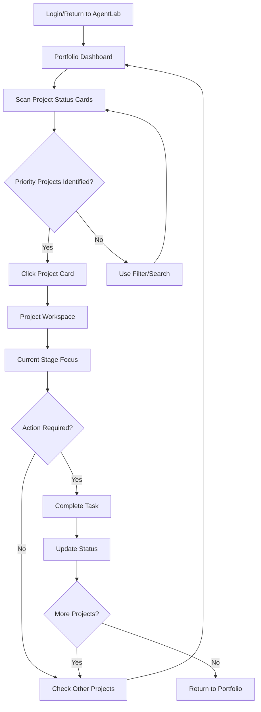
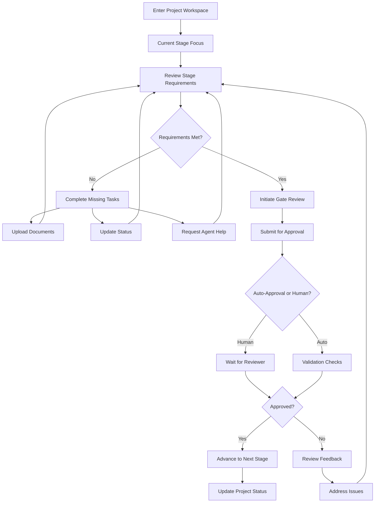
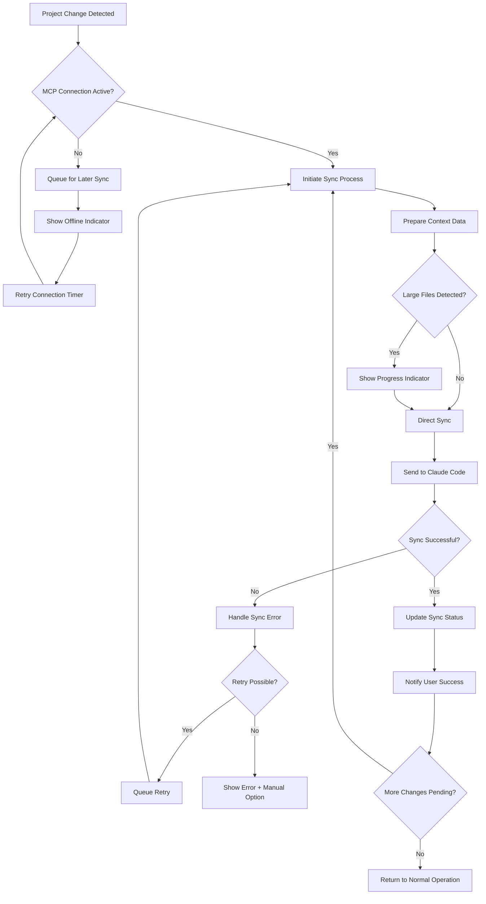

# AgentLab UI/UX Specification

This document defines the user experience goals, information architecture, user flows, and visual design specifications for **AgentLab**'s user interface. It serves as the foundation for visual design and frontend development, ensuring a cohesive and user-centered experience.

**Project Context:** AgentLab is a productivity-focused platform for DSI Product Owners managing 10-25 concurrent AI development projects. The interface emphasizes workflow automation, BMAD Method integration, and seamless Claude Code connectivity to reduce administrative overhead by 30-50%.

## Overall UX Goals & Principles

### Target User Personas
- **DSI Product Owner:** Technical professionals managing 10-25 concurrent projects, requiring efficiency and quick context switching
- **BMAD Workflow Specialist:** Users focused on workflow automation and gate validation processes
- **System Administrator:** Technical users configuring integrations and managing LLM providers

### Usability Goals
- **Workflow Efficiency:** Product Owners can switch between projects in under 3 seconds
- **Context Retention:** Users maintain full project context without information loss during transitions
- **Automation Integration:** BMAD workflow progression visible at-a-glance with one-click actions
- **Bilingual Flexibility:** Seamless switching between French business content and English technical documentation

### Design Principles (Refined based on competitive insights)

1. **Dashboard-First Navigation** - Portfolio overview as primary entry point with drill-down capability
2. **Information Architecture Over Aesthetics** - Every UI element serves workflow efficiency
3. **Progressive Context Disclosure** - Show relevant information based on current workflow stage
4. **Consistent Status Visualization** - Universal color coding with accessibility-compliant contrast
5. **Minimal Cognitive Overhead** - Reduce mental load with familiar interaction patterns from leading tools

**Key UX Differentiators for AgentLab:**
- **BMAD Method Integration:** Specialized workflow stages not found in generic PM tools
- **Claude Code Connectivity:** Real-time development environment sync unique to our use case
- **Bilingual Document Management:** French/English switching optimized for DSI's specific needs
- **AI Agent Assistance:** Contextual AI help integrated throughout the interface

### Change Log
| Date | Version | Description | Author |
|------|---------|-------------|---------|
| 2025-09-29 | 1.0 | Initial UI/UX specification creation | UX Expert Sally |

## Information Architecture (IA)

### Site Map / Screen Inventory

### Navigation Structure

**Primary Navigation:** Portfolio Dashboard, Client Management, Global Search, Settings - simplified to core user goals

**Workflow-Centric Sidebar:** Within Project Workspace, sidebar shows current stage prominently with contextual documents, gates, and AI assistance integrated per stage

**Contextual Breadcrumbs:** Client > Project > Current Stage (not separate document/file sections)

**Key Mental Model Alignments:**
- **Workflow as Primary Context:** Users work "in" a workflow stage, not "navigate to" workflow section
- **Document Integration:** Documents appear contextually within relevant workflow stages
- **Agent as Assistant:** AI help embedded where needed, not separate destination
- **Status-Driven Navigation:** "What needs attention" prominently featured in all views

## User Flows

### Flow 1: Project Portfolio Overview & Context Switching

**User Goal:** Quickly assess portfolio status and switch between projects requiring attention

**Entry Points:** Direct login, bookmark, or return from any deep project work

**Success Criteria:** User can identify priority projects and access current workflow stage within 3 seconds

#### Flow Diagram

#### Edge Cases & Error Handling:
- **No projects requiring attention:** Display "All up to date" with option to view full portfolio
- **System integration down:** Show cached status with "Last updated" timestamp
- **Slow project loading:** Progressive loading with skeleton states
- **Context loss during switching:** Maintain breadcrumb trail and "return to previous" option

### Flow 2: BMAD Workflow Stage Progression

**User Goal:** Progress a project through BMAD workflow stages with proper gate validation

**Entry Points:** Project workspace, dashboard notifications, or direct stage links

**Success Criteria:** User successfully advances project to next stage with all requirements validated

#### Flow Diagram

#### Edge Cases & Error Handling:
- **Missing required documents:** Clear checklist with upload prompts
- **Gate reviewer unavailable:** Escalation to backup reviewer or delayed approval notification
- **Workflow template changes:** Migration prompt with change summary
- **Concurrent modifications:** Conflict resolution with merge options

### Flow 3: Claude Code Project Synchronization

**User Goal:** Ensure AgentLab project changes sync with Claude Code development environment

**Entry Points:** Project workspace auto-sync, manual sync trigger, or sync status alerts

**Success Criteria:** All project context and feedback available in Claude Code within 10 seconds

#### Enhanced Flow Diagram

**Integration Flow Optimizations:**
- **Background Sync:** Non-blocking sync operations with status notifications
- **Smart Queuing:** Priority queuing for gate decisions and urgent feedback
- **Conflict Resolution:** Clear merge options when files modified in both environments
- **Connection Recovery:** Automatic reconnection with pending sync execution

## Wireframes & Mockups

**Primary Design Files:** Recommended Figma workspace for detailed visual designs, component library, and developer handoff specifications

### Key Screen Layouts (Component-Based)

#### Portfolio Dashboard
**Purpose:** Central command center for Product Owners to assess 10-25 concurrent projects and prioritize attention

**Key Elements:**
- `<PrimaryNavigation />` - Top navigation with active portfolio state
- `<ProjectStatusCard variant="card" />` - Grid of project cards with hover actions
- `<ActivityTimeline />` - Right sidebar showing recent portfolio changes
- `<FilterSearchBar />` - Project filtering with saved search options
- `<ActionToolbar actions={["sync-all", "bulk-approve", "export"]} />`

**Interaction Notes:** Card hover reveals quick actions, click opens project workspace, drag-and-drop for prioritization

#### Project Workspace - Current Stage Focus
**Purpose:** Deep work environment for BMAD workflow progression with integrated context

**Key Elements:**
- `<BreadcrumbNav path={["ClientName", "ProjectName", "CurrentStage"]} />`
- `<ProgressStepper stages={bmadStages} current="requirements" />`
- `<DocumentViewer content={stageDocuments} comments={true} />`
- `<GateReviewPanel enabled={stageComplete} />`
- `<FileSyncIndicator status="synced" lastSync="2min ago" />`

**Interaction Notes:** Stage navigation via progress stepper, document annotations trigger auto-save, agent panel slides in contextually

#### Gate Review Interface
**Purpose:** Specialized interface for workflow validation and approval decisions

**Key Elements:**
- `<PageHeader title="Gate Review" actions={["history", "escalate"]} />`
- `<StatusBadge variant="pending-approval" />`
- `<DocumentViewer split={true} showDiff={true} />`
- `<CommentThread threads={reviewComments} />`
- `<GateReviewPanel variant="reviewer" actions={["approve", "reject", "request-changes"]} />`

**Interaction Notes:** Checklist completion unlocks approval actions, comments required for rejections, bulk approval for multiple criteria

## Component Library / Design System

**Design System Approach:** Build upon shadcn/ui foundation (specified in PRD) with AgentLab-specific components for workflow management, BMAD Method integration, and Claude Code connectivity

### Core Components

#### Project Status Card
**Purpose:** Display project information with workflow status across different view modes

**Variants:**
- `list` - Compact table row with essential information
- `card` - Medium detail card for dashboard grid
- `detail` - Full information panel for project workspace

**States:** Default, hover, selected, loading, error, offline (when Claude Code disconnected)

**Layout Tokens:**
- List variant: `spacing-sm` (8px) padding, `size-12` (48px) height
- Card variant: `spacing-md` (16px) padding, `border-radius-lg` (8px)
- Detail variant: `spacing-lg` (24px) padding, `border-radius-xl` (12px)

**Usage Guidelines:** Use list variant for 25+ project portfolios, card variant for dashboard overview, detail variant for project workspace header

#### Status Badge
**Purpose:** Universal workflow status indication with consistent color coding

**Variants:**
- `pending` - `color-status-warning` (#F59E0B) with `color-warning-bg` (#FEF3C7)
- `active` - `color-status-info` (#3B82F6) with `color-info-bg` (#DBEAFE)
- `completed` - `color-status-success` (#10B981) with `color-success-bg` (#D1FAE5)
- `blocked` - `color-status-error` (#EF4444) with `color-error-bg` (#FEE2E2)
- `draft` - `color-neutral-500` (#6B7280) with `color-neutral-100` (#F3F4F6)

**States:** Static, animated (for active processes), with tooltips for additional context

**Usage Guidelines:** Always pair with descriptive text for accessibility, use consistently across all workflow contexts

#### Progress Stepper
**Purpose:** Visual representation of BMAD workflow stage progression

**Variants:**
- `horizontal` - For wide layouts (desktop project workspace)
- `vertical` - For narrow layouts (sidebar navigation)
- `mini` - Condensed version for cards and lists

**States:**
- Past stages (completed with checkmark)
- Current stage (highlighted with pulse animation)
- Future stages (muted with outline styling)
- Blocked stages (red with warning indicator)

**Color Tokens:**
- Completed stages: `color-success-600` with `color-success-100` background
- Current stage: `color-primary-600` with `color-primary-100` background + `shadow-focus-ring`
- Future stages: `color-neutral-400` with `color-neutral-50` background
- Blocked stages: `color-error-600` with `color-error-100` background

**Usage Guidelines:** Always show user's current position in workflow, provide click navigation to accessible stages, disable navigation to locked future stages

#### Document Viewer
**Purpose:** Markdown rendering with AgentLab-specific features for project documentation

**Variants:**
- `standard` - Full document view with navigation
- `split` - Side-by-side comparison for change tracking
- `embedded` - Inline viewer for stage-specific documents
- `comment-mode` - Document with inline annotation capabilities

**States:** Loading skeleton, error state, read-only, edit mode, sync status indicators

**Usage Guidelines:** Use split variant for gate reviews, embedded variant within workflow stages, comment-mode for collaborative review processes

## Branding & Style Guide

### Visual Identity
**Brand Guidelines:** DSI corporate standards with minimal, professional aesthetic emphasizing workflow status indicators and productivity focus over stylized elements

### Color Palette

| Color Type | Hex Code | Usage |
|------------|----------|-------|
| Primary | #2563EB | Primary actions, current workflow stage, brand elements |
| Secondary | #64748B | Secondary actions, inactive states, supporting text |
| Accent | #F59E0B | Attention-required items, warnings, pending approvals |
| Success | #10B981 | Completed stages, successful syncs, approved gates |
| Warning | #F59E0B | Pending reviews, sync conflicts, attention needed |
| Error | #EF4444 | Blocked stages, failed syncs, rejected gates |
| Neutral | #6B7280, #9CA3AF, #D1D5DB, #F3F4F6 | Text, borders, backgrounds, disabled states |

### Typography

#### Font Families
- **Primary:** Inter (system: -apple-system, BlinkMacSystemFont, "Segoe UI", Roboto, sans-serif)
- **Secondary:** Same as primary (consistent hierarchy through weight/size variation)
- **Monospace:** "JetBrains Mono", "Fira Code", Consolas, monospace (for code blocks in documents)

#### Type Scale

| Element | Size | Weight | Line Height |
|---------|------|--------|-------------|
| H1 | 24px (1.5rem) | 600 (Semibold) | 1.2 (29px) |
| H2 | 20px (1.25rem) | 600 (Semibold) | 1.3 (26px) |
| H3 | 18px (1.125rem) | 500 (Medium) | 1.4 (25px) |
| Body | 16px (1rem) | 400 (Regular) | 1.5 (24px) |
| Small | 14px (0.875rem) | 400 (Regular) | 1.4 (20px) |

### Iconography
**Icon Library:** Heroicons (outlined style) for consistency with Tailwind/shadcn ecosystem, ensuring accessibility and professional appearance

**Usage Guidelines:**
- Use outlined style for consistency with clean, professional aesthetic
- 24px standard size for primary actions, 16px for inline text icons
- Maintain 4.5:1 contrast ratio for all icon/background combinations
- Pair icons with text labels for accessibility and clarity

### Spacing & Layout
**Grid System:** 8px base grid system with 12-column layout for responsive design, optimized for desktop-primary usage with tablet compatibility

**Spacing Scale:**
- xs: 4px, sm: 8px, md: 16px, lg: 24px, xl: 32px, 2xl: 48px
- Component-specific spacing maintained through design tokens
- Consistent application across cards, lists, forms, and navigation elements

## Accessibility Requirements

### Compliance Target
**Standard:** WCAG 2.1 AA compliance for inclusive DSI environment and potential future open-source adoption

### Key Requirements

**Visual:**
- Color contrast ratios: 4.5:1 minimum for normal text, 3:1 for large text (18px+ or 14px+ bold)
- Focus indicators: 2px solid outline in primary color (#2563EB) with 2px offset for visibility
- Text sizing: Minimum 16px for body text, scalable to 200% without horizontal scrolling

**Interaction:**
- Keyboard navigation: Full keyboard access with logical tab order through all interactive elements
- Screen reader support: ARIA labels, landmarks, and live regions for dynamic content updates
- Touch targets: Minimum 44px × 44px for all interactive elements on tablet/mobile views

**Content:**
- Alternative text: Descriptive alt text for all informational images, decorative images marked as such
- Heading structure: Logical heading hierarchy (H1 > H2 > H3) without skipping levels
- Form labels: Explicit labels for all form inputs with error state descriptions

### Keyboard Navigation System

**Global Navigation Shortcuts:**
- `Alt + D` - Jump to Portfolio Dashboard
- `Alt + C` - Open Client Management
- `Alt + S` - Open System Settings
- `Alt + /` - Focus global search
- `Alt + N` - Create new project
- `Ctrl + K` - Command palette for quick actions

**Project Workspace Navigation:**
- `1-9` - Jump to specific workflow stages
- `G then A` - Gate approval actions
- `D` - Toggle document viewer
- `A` - Toggle agent assistance panel
- `S` - Manual sync with Claude Code

**Power User Optimizations:**
- `Alt + 1-9` - Switch to recent projects (MRU list)
- `Ctrl + Tab` - Cycle through open project workspaces
- `Ctrl + S` - Bulk sync selected projects

### Testing Strategy
**Automated Testing:** axe-core integration in development pipeline for continuous accessibility validation during component development

**Manual Testing:** Keyboard-only navigation testing and screen reader validation (NVDA/JAWS) for critical user flows including portfolio navigation, project creation, and gate approval workflows

**User Testing:** Validation with DSI team members who use assistive technologies to ensure real-world accessibility

## Responsiveness Strategy

### Breakpoints

| Breakpoint | Min Width | Max Width | Target Devices |
|------------|-----------|-----------|----------------|
| Mobile | 320px | 767px | Emergency access only - status checking |
| Tablet | 768px | 1023px | Client meetings, reviews, approval workflows |
| Desktop | 1024px | 1439px | Primary Product Owner workstation |
| Wide | 1440px | - | Multi-monitor setups, power user configurations |

### Adaptation Patterns

**Layout Changes:**
- Desktop: Three-column layout (navigation + main content + activity feed)
- Tablet: Adaptive two-column layout with slide-over panels for tertiary content
- Mobile: Single-column stack with bottom navigation

**Navigation Changes:**
- Desktop: Persistent sidebar + top navigation for full context
- Tablet: Tab bar at bottom + collapsible drawer with gesture-based navigation
- Mobile: Bottom tab bar for core sections, hamburger for secondary

**Content Priority:**
- Desktop: All information visible simultaneously for rapid context switching
- Tablet: Progressive disclosure with swipe-to-reveal secondary information
- Mobile: Essential status only, progressive disclosure for details

**Interaction Changes:**
- Desktop: Hover states, right-click context menus, keyboard shortcuts
- Tablet: Touch-optimized with 60px targets, swipe gestures, haptic feedback, and palm rejection
- Mobile: Simplified touch interactions, reduced information density

### Tablet-Specific Workflows

**Client Meeting Workflow:**
- Portfolio Review: Swipe between client project groups, tap to expand project details
- Project Presentation: Full-screen project workspace with gesture navigation between stages
- Real-time Status Updates: Pull-to-refresh for live sync with Claude Code during development discussions
- Quick Approvals: Large touch targets (60px minimum) for gate approval actions

**Gate Review Workflow (Touch-Optimized):**
- Criteria Checklist: Large checkbox targets with haptic feedback for completion
- Document Annotation: Touch-drag to highlight text, tap-to-comment with floating action button
- Approval Actions: Swipe gestures for approve/reject with confirmation haptics
- Multi-stage Review: Horizontal swipe between workflow stages with progress indicator

## Animation & Micro-interactions

### Motion Principles (Business-Optimized)
**Purposeful Motion:** All animations serve workflow efficiency - provide feedback, guide attention, or smooth transitions. No decorative animations that could distract from productivity-focused tasks.

**Professional Restraint:** All animations under 400ms duration align with business software expectations, with functional purpose over visual engagement.

**Performance-First:** Animations optimized for 60fps performance, with reduced motion respect for accessibility preferences.

### Key Animations (Professional Context)

**Status & Workflow Feedback:**
- **Gate Approval Confirmation:** Subtle checkmark animation with single color pulse (Duration: 200ms, Easing: ease-out)
- **Project Status Updates:** Smooth badge color transition without scale effects (Duration: 150ms, Easing: ease-out)
- **Sync Status Indicator:** Minimal rotating icon with immediate stop on completion (Duration: 800ms loop, Easing: ease-linear)

**Navigation & Context (Business-Appropriate):**
- **Project Selection:** Subtle border highlight without elevation changes (Duration: 100ms, Easing: ease-out)
- **Panel Transitions:** Instant content swap with 100ms opacity fade (Duration: 100ms, Easing: ease-out)
- **Progress Stepper Advancement:** Stage completion with checkmark animation (Duration: 400ms, Easing: ease-in-out)

**Error & Validation (Professional Tone):**
- **Form Validation:** Single subtle red border pulse without shake (Duration: 200ms, Easing: ease-out)
- **Connection Issues:** Immediate status change with subtle icon opacity (Duration: 150ms, Easing: ease-out)
- **Bulk Operation Feedback:** Progress bar fill without decorative effects (Duration: Variable, Easing: ease-linear)

**Professional Context Benefits:**
- **Client Confidence:** Subtle, reliable animations convey system stability and professional quality
- **Meeting Efficiency:** Reduced animation durations prevent delays during live presentations
- **Corporate Appropriateness:** Animation style aligns with business software expectations
- **Distraction Minimization:** Animations support workflow without competing for attention

## Performance Considerations

### Performance Goals
- **Page Load:** Under 2 seconds for dashboard with 25+ projects on standard business internet
- **Interaction Response:** Sub-200ms response for all user interactions (clicks, taps, navigation)
- **Animation FPS:** Consistent 60fps for all animations and smooth scrolling during portfolio navigation

### Design Strategies
**Component Virtualization:** Large project lists use virtual scrolling to maintain performance with 50+ concurrent projects, rendering only visible items plus small buffer for smooth scrolling experience.

**Progressive Loading:** Dashboard loads critical project status first (300ms), then secondary information (activity feed, detailed metrics) in subsequent chunks to provide immediate value while background loading completes.

**Optimized Asset Strategy:** All icons use SVG sprites, images are WebP with AVIF fallbacks, and fonts are preloaded with display: swap to prevent layout shifts during initial page load.

**State Management Efficiency:** React Query for server state caching reduces API calls, Zustand for client state minimizes re-renders, and strategic memo usage prevents unnecessary component updates during rapid project switching.

**Claude Code Integration Performance:** MCP connections use connection pooling and background sync queuing to prevent UI blocking, with sync status updates via lightweight WebSocket connections rather than polling.

## Next Steps

### Immediate Actions
1. **Stakeholder Review:** Present UX specification to DSI Product Owners for validation of workflow assumptions and interface priorities
2. **Figma Workspace Creation:** Establish design file structure with component library, wireframes, and detailed mockups based on this specification
3. **Design System Implementation:** Begin shadcn/ui customization with AgentLab design tokens and component variants
4. **Technical Architecture Handoff:** Collaborate with Design Architect to ensure UX requirements align with FastAPI backend and MCP integration constraints

### Design Handoff Checklist
- [x] All user flows documented
- [x] Component inventory complete
- [x] Accessibility requirements defined
- [x] Responsive strategy clear
- [x] Brand guidelines incorporated
- [x] Performance goals established

---

**Document Status:** Complete - Ready for stakeholder review and technical architecture phase

**Next Phase:** Technical Architecture Design with focus on component implementation and MCP integration patterns